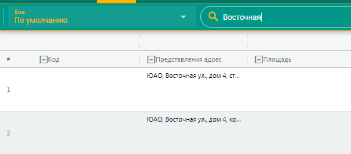
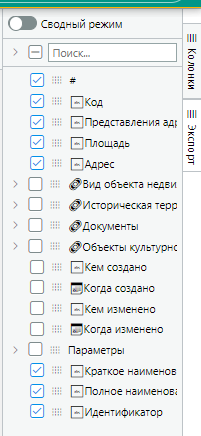
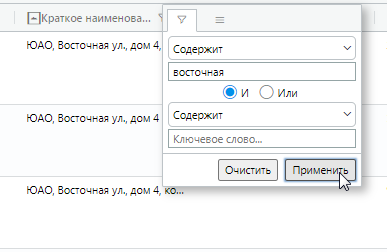
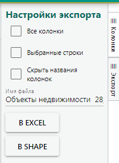
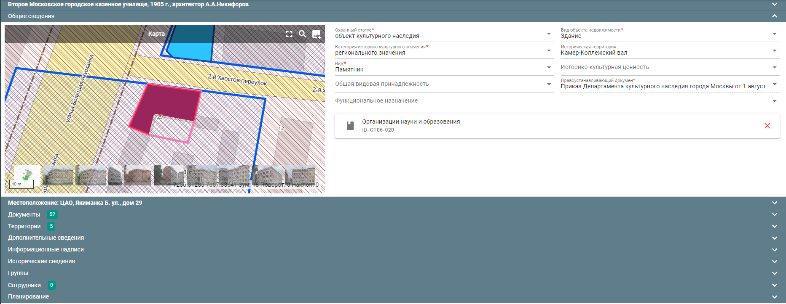
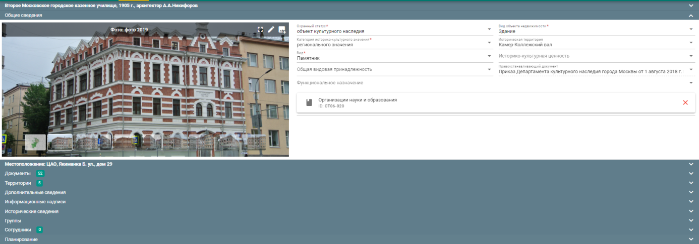
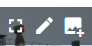
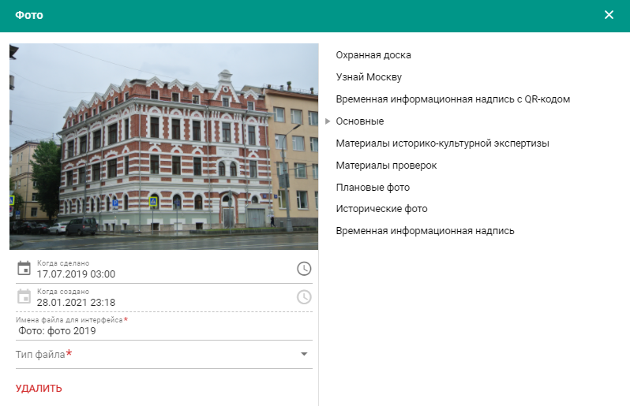
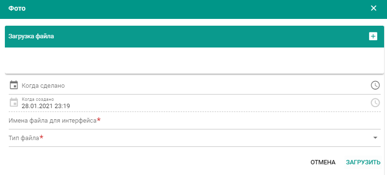
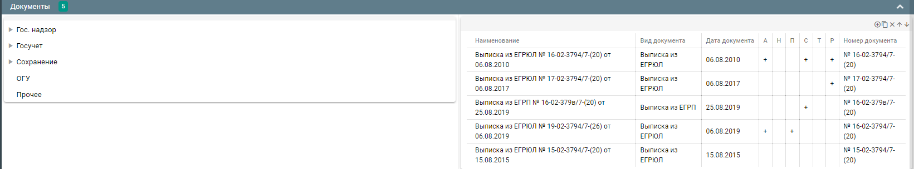

---
tags:
  - subsystem
---
Подсистема «Археология»
=======================

Подсистема обеспечивает ведение дел участковых полевых работ, объектов
археологического наследия, участков археологического исследования,
остатков подземных частей древних сооружений, находок/кладов и их
картографических контуров, что составляет т.н. «Археологическую карту»
АИС МГН.

Реестр «Дела участков полевых работ» (см. рис.320) находится в меню в
разделе «Реестры» и содержит перечень данных о научном отчете, Акте
ГИКЭ, Заключении Мосгорнаследия о согласии с Актом. Карточка дела
участка полевых работ состоит из двух блоков -- Основные сведения и
Документы. Блок «Основные сведения» содержит информацию о номере дела,
дате регистрации и адресе земельного участка. Блок «Документы»
отображает информацию о документе и возможность крепления самого
документа: «Научный отчет», «Акт ГИКЭ», «Заключение Мосгорнаследия о
согласии с Актом», «Приказ Министерства культуры Российской Федерации об
аттестации эксперта или экспертов», «Ситуационный план».

{width="6.708333333333333in"
height="2.8125in"}

**Рис. 320.** Реестр «Дела участков полевых работ»

По двойному клику на запись можно попасть в карточку дела (см. рисунок
321).

{width="6.511111111111111in"
height="3.0430555555555556in"}

**Рис. 321**. Карточка дела участков полевых работ

Также есть возможность распечатки отчетов по нажатию на панель отчетов:

{width="4.364583333333333in"
height="1.8319444444444444in"}

**Рис. 322.** Печать отчетов

Соответствующие слои отображены в разделе «Археологическая карта»
подсистемы «ИКОП»:

-   Палеорельеф;

-   Гидрогеология;

-   Мощность культурного слоя;

-   Степень сохранности культурного слоя;

-   Остатки подземных частей древних сооружений;

-   Участки археологических исследований;

-   Находки, клады;

<!-- -->

-   Разведочные шурфы;

-   Участки исследований по разведкам;

-   Бесперспективные участки.

Разработанные слои содержат информацию на основании систематизации
сведений об археологии подсистемы «Археология». Для данных слоев
применимы все существующие функции ИКОП, описанные в п.16 (см. рис.323).

{width="6.708333333333333in"
height="3.21875in"}

**Рис. 323**. Образец археологической карты ИКОП

{width="6.708333333333333in"
height="3.15625in"}

**Рис. 324**. Мощность культурного слоя

{width="6.708333333333333in"
height="3.1875in"}

**Рис. 325**. Степень сохранности культурного слоя

Подсистема поиска данных
========================

Подсистема обеспечивает контекстный поиск данных подсистемы
«Государственные услуги» по следующим объектам поиска (см. рис.326):

-   заказчику;

-   проектировщику;

-   примечаниям к ОКН.

{width="6.708333333333333in"
height="3.9895833333333335in"}

**Рис. 326**. Образец контекстного поиска в реестре ОГУ

Для этого необходимо в контекстной строке ввести ключевое слово для
поиска. Данная функция производит поиск данных по всем полям реестра по
ключевому слову (набору ключевых слов) и отбирает соответствующие записи
в текущем реестре.

Также подсистема обеспечивает сквозной контекстный поиск данных Системы
по следующим объектам поиска:

-   объектам культурного наследия;

-   территориям;

-   объектам недвижимости;

-   адресам БТИ.

Для этого необходимо в строке сквозного контекстного поиска ввести
ключевое слово, например, фрагмент адреса объекта или его наименование.

Результаты поиска категоризируется по типу объектов поиска (ОКН,
территории, ОН, Адреса БТИ) и отображается в виде списка с подсвеченными
ключевыми фразами. Существует возможность перехода к объектам поиска на
карте подсистемы «ИКОП» или соответствующую карточку подсистемы «ГРНКН»
(см. рис.327).

{width="5.15625in"
height="4.927083333333333in"}

**Рис. 327**. Пример формирования результатов контекстного поиска

Для перехода в карточку найденного объекта необходимо нажать на
соответствующую запись.

Для перехода к контуру объекта на карте необходимо нажать лупу
{width="0.4in"
height="0.3736111111111111in"}.

Также есть возможность добавления объектов в набор с помощью выделения
галочек и отображение их на карте группой с помощью кнопки «Показать на
карте».
