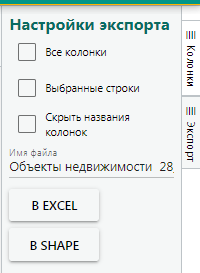
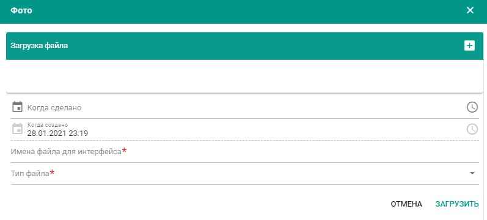

---
tags:
  - subsystem
---
Подсистема «Городской реестр недвижимого культурного наследия города Москвы»
============================================================================

В подсистеме осуществляется автоматизированный процесс учета данных об
ОН, ОКН, охранных территориях, связанных с ними ЮФЛ, мемориальных
досках, работы с документами и фотоматериалами, а также по планированию
документального обеспечения государственной охраны.

Списки учетных объектов каждой сущности представлены в соответствующих
Реестрах.

В каждом реестре реализованы:

полнотекстовым поиск,

{width="6.113194444444445in"
height="2.676388888888889in"}

**Рис. 20.** Полнотекстовой поиск

пользовательская настройка видимости столбцов с атрибутами,

{width="2.0930555555555554in"
height="2.558333333333333in"}

**Рис. 21.** Видимость столбцов с атрибутами

фильтрация по условиям, сортировка данных по столбцам,

{width="4.030555555555556in"
height="2.6243055555555554in"}

**Рис. 22.** Сортировка данных по столбцам

переход в карточку объекта при клике на строку в реестре,

переход из карточки объекта в карточку связанной сущности,

экспорт набора табличных данных в Excel,

экспорт набора геоданнх в Shape.

{width="2.082638888888889in"
height="2.8430555555555554in"}

**Рис. 23.** Экспорт данных

Раздел «Объекты недвижимости»
-----------------------------

Раздел «Объекты недвижимости» позволяет пользователю получать
необходимую информацию на основании сведений по объектам недвижимости,
хранящимся в системе.

Все учетные объекты отображаются в реестре «Объекты недвижимости».

Поиск объекта осуществляется при нажатии кнопки «Найти», а также
введением информации в поле поиска.

Основное меню раздела «Объекты недвижимости» позволяет осуществлять
сортировку объектов по основаниям:

1.  Наименование объекта (Адрес БТИ);

2.  Вид объекта недвижимости;

После выбора пользователем соответствующего объекта в общем списке
объектов (при клике на него), выводится информация по данному объекту на
основе данных, хранящихся в Системе.

По ссылкам осуществляется переход в карточки связанных сущностей
(объекты, ЮФЛ)

Для создания Объекта недвижимости в Системе требуется нажать «Создать»,
открывается перечень ОН. Через поиск найти и выбрать адрес из
справочника БТИ.

В случае отсутствия требуемого адреса в справочнике БТИ возможно
создание ОН на основании документа. Требуется нажать «Создать на
основании документа», заполнить поля карточки и прикрепить скан
документа-основания.

В полях Основного подраздела карточки хранится информация на основании
данных БТИ, в поле площадь -- Росреестра. Она не подлежит
редактированию.

В поле «Уточняющие сведения по БТИ» доступно внесение текстового
комментария, например, указание, что ОКН является частью ОН, в таком
случае в поле вноситься слово «Часть».

По завершении редактирования/внесения данных по объекту, информация
фиксируется в Системе нажатием кнопки «Сохранить».

Раздел «Объекты культурного наследия»
-------------------------------------

Все учетные объекты отображаются в реестре «Объекты культурного
наследия».

Поиск объекта осуществляется при нажатии кнопки «Найти», а также
введением информации в поле поиска.

Открытие карточки объекта осуществляется через результаты поиска в окне
поиска. При клике на строку с найденным объектом открывается учетная
карточка.

{width="6.299305555555556in"
height="2.441666666666667in"}

**Рис. 24.** Учетная карточка ОКН

Справа расположен фрагмент ИКОП, отображающий местоположение объекта и
наличие у него охранных территорий. Внизу окна карты отображается лента
с миниатюрами фотоизображений объекта. При клике миниатюру фотография
открывается в окне вместо карты, сверху находится название фотографии.

{width="6.299305555555556in"
height="2.2111111111111112in"}

**Рис. 25.** Учетная карточка ОКН

Доступны инструменты работы с фотографией:

{width="0.9576388888888889in"
height="0.47847222222222224in"}

-   Развернуть/свернуть во весь экран

-   Редактировать. При нажатии открывается карточка фото с возможностью
    просмотра и изменения атрибутивных полей фото.

{width="6.299305555555556in"
height="4.065277777777778in"}

**Рис. 26.** Карточка фото с возможностью просмотра и изменения
атрибутивных полей

-   Создать фото. При нажатии создается новая карточка фото, поля
    доступны для заполнения.

> {width="6.299305555555556in"
> height="2.8534722222222224in"}

**Рис. 27.** Создать фото

На закладке «Основная» карточки ОКН перечислены: наименование ансамбля,
наименование объекта, охранный статус объекта, категория
историко-культурного значения, вид объекта, вид объекта недвижимости,
историческая территория, историко-культурная ценность,
правоустанавливающий документ, функциональное назначение,
местоположение.

Во вкладке Документы слева отображается дерево документов (распределение
документов по тематическим направлениям деятельности ДКН), а слева --
перечень документов с их реквизитами. Состав документов можно
просматривать по одному или по всем разделам. Переход в карточку
документа осуществляется по клику по строке документа.

{width="6.497222222222222in"
height="1.207638888888889in"}

**Рис. 28.** Документы ОКН

Пользователь (при необходимом доступе к функциям Системы) может
осуществить редактирование соответствующей информации или внести
недостающие данные. Система также предоставляет возможность получать
информацию по документам в части данного объекта, добавлять новый
документ.

Для добавления нового документа нажать на панели действий на кнопку
«Добавить документ». Откроется окно, в котором перечислены документы в
виде дерева. Доступен поиск по списку документов по ключевому атрибуту.

Выбрать необходимую категорию и вид документа, нажать на кнопку
«Создать» на панели действий в окне «Документы».

Во вкладке «Территории» отображаются охранные территории, на которых
расположен учетный объект, с указанием правоустанавливающих документов,
определяющих охранный статус территории. При клике на строку с названием
территории осуществляется переход в карточку выбранной территории.

Для добавления новой охранной территории требуется нажать на панели
действий на кнопку «Добавить». Откроется окно, в котором перечислены
территории, для выбора необходимой. Доступен поиск по списку территорий
по ключевому слову.

На вкладке «Дополнительные сведения» указывается:

1.  Авторство и датировка объекта,

2.  Учетные номера объекта: номер в ЕГР ОКН, номер ЕГРНКН, кадастровый
    > номер;

3.  Информация о размещении в проекте «Узнай Москву»

4.  Служебная информация:

-   Зарегистрирован в Росреестре

-   В ведении Минкультуры РФ

-   Уточнение наименования

-   Уточнение состава

-   Утрачен

-   Ист./арх.

5.  Описание предмета охраны;

6.  Уточняющие сведения.

{width="6.493055555555555in"
height="1.9013888888888888in"}

**Рис. 29.** Уточняющие сведения

Во вкладке «Информационные надписи» отображается информация по
информационным надписям, установленным на объекте культурного наследия
(охранная доска, Мемориальная доска, Временная информационная надпись с
QR-кодом, Временная информационная надпись).

В подразделе Охранная доска для добавления/изменения фото при нажатии на
поле открывается проводник для выбора файла с фото, признак
«Установлена» определяется наличием флага. Характеристики заполняются из
справочников. Сведения о Доп. Надписях вносятся текстом в произвольном
порядке.

Для создания или прикрепления документа нужно воспользоваться мастером,
который открывается по кнопке
{width="0.21805555555555556in"
height="0.28055555555555556in"} . В мастере доступно создание нового
документа (открывается карточка документа для заполнения обязательных
полей и прикрепления скана) и поиск и выбор существующего документа.

{width="3.957638888888889in"
height="0.3326388888888889in"}

**Рис. 30.** Панель инструментов раздела Документы

В подразделе Мемориальная доска отображаются мемориальные доски, у
которых связанный ОН соответствует связанному ОН в разделе
Местонахождение рассматриваемого объекта. По кнопке
{width="0.21805555555555556in"
height="0.28055555555555556in"} открывается карточка мемориальной доски
для создания, заполнив поля карточки сущности мемориальная доска.

Раздел «Временная информационная надпись с QR-кодом». Для
добавления/изменения фото при нажатии на поле открывается проводник для
выбора файла с фото, признак «Установлена» определяется наличием флага.
Характеристики заполняются из справочников.

В подраздел «Временная информационная надпись» для добавления/изменения
фото при нажатии на поле открывается проводник для выбора файла с фото,
признак «Установлена» определяется наличием флага. Характеристики
заполняются из справочников. Для добавления нескольких записей об
установленных инф. Надписях требуется
кнопкой{width="0.21805555555555556in"
height="0.28055555555555556in"} добавлять строки, в которых указывается
тип установленной информационной надписи.
{width="1.6659722222222222in"
height="0.31180555555555556in"}

{width="6.602777777777778in"
height="2.1555555555555554in"}

**Рис. 31.** Информационные надписи

> В разделе «Лица и правоотношения» отображается информация по ЮФЛ,
> связанным с ОН (адрес БТИ, вид собственности, кад. номер, ЮФЛ, часть,
> файл, основание). При клике по строке открывается карточка связи ОН и
> ЮФЛ. При клике на Документ, открывается карточка Документа.
>
> Внесение данных осуществляется через карточку связи ОН и ЮФЛ.

{width="6.497222222222222in"
height="0.47152777777777777in"}

**Рис. 32.** Связь ОН и ЮФЛ

Внесение и изменение данных раздела «Исторические сведения» по всем
полям осуществляется в режиме текста.

{width="6.497222222222222in"
height="1.1409722222222223in"}

**Рис. 33.** Исторические сведения

В подразделе Группы отображаются ссылки на карточки групп, в которые
включен объект. Для перехода в карточку Группы для просмотра и
редактирования состава группы нужно кликнуть по строке с названием
группы. Раздел может быть не заполнен, если объект не входит ни в одну
группу.

На вкладке «Сотрудники» перечислены ответственные за объект сотрудники
УТК. Список содержит информацию о фамилии, имени, отчестве и должности
сотрудника.

В разделе Планирование доступно внесение информации в текстовые поля,
позволяющие осуществлять планирование и контроль по организации выпуска
документации по государственной охране объектов культурного наследия, а
также по наличию необходимой охранной документации в соответствии с
законодательством.

{width="6.299305555555556in"
height="1.6972222222222222in"}

**Рис. 34.** Планирование

История внесения изменений в карточку объекта отображается в верхнем
левом углу карточки, открывается для просмотра при нажатии кнопки

{width="2.9055555555555554in"
height="0.7284722222222222in"}

**Рис.35.** История изменений

и отображаются содержатся данные в табличном виде о внесенных изменениях
в карточке, с указанием даты, времени и сотрудника.

Раздел «Юридические и физические лица»
--------------------------------------

При взаимодействии Системы с АСУР ИСИ синхронизации подлежат данные о
физических или юридических лицах, обращающихся в ДКН за ОГУ. Результатом
взаимодействия являются актуальные данные заявителей при ОГУ. Для учета
лиц, имеющих правоотношения к ОН, являющихся ОКН, в Системе сформирован
справочник ЮФЛ на основании Выписок из ЕГРП.

Для введения новой информации по юридическим и физическим лицам
используется форма «Юридические и физические лица (создание)», которая
открывается в разделе «Объекты недвижимости» при нажатии в левом меню
«Юридические и физические лица» и далее кнопки «Создать». В форме
«Юридические и физические лица (создание)» Пользователь вводит
информацию на следующих вкладках:

-   Объекты недвижимости;

-   Основные сведения:

-   Наименование юридического/физического лица;

-   Юридическое/физическое лицо -- выбор из списка;

-   Полное наименование;

-   ИНН;

-   КПП;

-   Код по ОКП;

-   ОГРН;

-   Фактический адрес;

-   Юридический адрес.

-   Объекты недвижимости:

-   Наименование;

-   ОН;

-   Права на объект

-   Документы:

-   Категория;

> По завершении внесения данных, информация в Системе фиксируется
> нажатием кнопки Сохранить.

Раздел «Документы»
------------------

В разделе осуществляется учет, создание и систематизация всей
документации ДКН, внесенной в составе ГРНКН, а также полученной и
разработанной в процессе ОГУ.

По перечню Документов доступно выполнение Поиска. Из результатов поиска
по клику осуществляется переход в карточку документа.

{width="6.441666666666666in"
height="2.4069444444444446in"}

**Рис. 36.** Учетная карточка документа

Для структурирования документов разработано Дерево документов:
разделение документов по виду и по видам деятельности ДКН.

Определение раздела документа осуществляется на этапе заполнения
обязательного поля карточки Документа «Вид документа». Для уточнения
вида документа и определения его положения в Дереве документов
используются Уточняющие сведения

А-уточнение/утверждение адреса

Н- уточнение/утверждение наименования

П - уточнение/утверждение предмета охраны

Р - уточнение/утверждение режима использования территорий

С - уточнение/утверждение охранного статуса

Т - уточнение/утверждение границы территории объекта

Добавление документа по статусу при создании новой карточки является
обязательным.

Для создания карточки нового Документа требуется нажать «Создать»,
откроется пустая форма карточки для внесения реквизитов документа и вида
документа. Поле Наименование формируется автоматически: является
составным из данных полей Вид документа, дата, номер.

Электронный образ документа в pdf формате является обязательным для
прикрепления. При нажатии на окно обзора открывается Проводник для
выбора файла скана. После выбора и сохранения документ доступен в окне
просмотра, стрелки навигации позволяют осуществлять постраничный
последовательный просмотр документа, возможно развертывание документа по
ширине экрана.

Во вкладке документа «Владельцы» отображаются связи документа с другими
сущностями АИС МГН (объектами культурного наследия, объектами
недвижимости, территориями и группами).

Для формирования связи требуется перейти во вкладку и нажать кнопку
добавить владельца. Откроется перечень типов сущностей владельцев
документа. После выбора типа отображается список всех объектов
выбранного типа. Для поиска объекта используется стандартная функция
поиска АИС МГН по атрибутам объекта, внесенных в поля карточки (код,
наименование, адрес, номер и др.).

После выбора объекта он отображается во вкладке «Владельцы документа» в
виде ссылки, при клике на которую открывается карточка объекта.

При установлении связи с объектом текущий документ будет отображаться в
карточке объекта во вкладке «Документы».

Для классификации информации, которая содержится в текущем документе
относительно связанного объекта, используются маркеры уточняющих
сведений (УС).

Для установления маркеров требуется установить флаг в нужном разделе.

Для удаления связи документа и владельца требуется выделить объект и
нажать кнопку «Исключить объект».

{width="6.497222222222222in"
height="0.9513888888888888in"}

> **Рис. 37.** Владельцы документа

Раздел \"Территории\"
---------------------

В разделе осуществляется учет, создание и систематизация территорий и
зон охраны объектов культурного наследия. Все учетные территории
отображаются в реестре Территорий.

По перечню Территорий доступно выполнение Поиска. Из результатов поиска
по клику осуществляется переход в карточку территории.

В верхней левой части карточки расположен фрагмент ИКОП, отображающий
местоположение охранной территории в городе Москве. Переход в подсистему
ИКОП осуществляется при нажатии кнопки
{width="0.22847222222222222in"
height="0.3951388888888889in"}/

{width="5.709027777777778in"
height="2.9180555555555556in"}

> **Рис. 38.** Подсистема ИКОП

Для создания карточки новой территории в Реестре требуется нажать
«Создать», откроется пустая форма карточки для внесения атрибутов
территории.

Для территорий с видом «Территория объекта» поле «Наименование
территории» является обязательным.

Для видов объекта: Территория, Защитная зона, Проект границ территории
поле Адрес заполняется из связанных ОКН, является обязательным.

Во вкладке «ОКН» отображаются связи документа с другими сущностями АИС
МГН (объектами культурного наследия и группами)

Для формирования связи требуется перейти во вкладку и нажать кнопку
добавить запись. Откроется перечни ОКН и Групп. Для поиска объекта
используется стандартная функция поиска АИС МГН по атрибутам объекта,
внесенных в поля карточки (код, наименование, адрес, номер и др.).

После выбора объекта он отображается во вкладке «ОКН» в виде ссылки, при
клике на которую открывается карточка объекта.

При установлении связи с объектом текущая территория будет отображаться
в карточке объекта во вкладке «Территории».

Документы (отображаются согласно Дереву документов аналогично карточке
ОКН, с возможностью добавления новых связей).

Добавление документа по статусу при создании новой карточки является
обязательным.

Для классификации информации, которая содержится в документе
относительно связанного объекта, используются маркеры уточняющих
сведений (УС).

Для установления маркеров требуется установить флаг в нужном разделе.

Для удаления связи документа и владельца требуется выделить объект и
нажать кнопку «Исключить объект».

{width="6.299305555555556in"
height="0.8319444444444445in"}

**Рис. 39.** Документы территории

Раздел \"Мемориальные доски\"
-----------------------------

В разделе осуществляется учет, создание и систематизация Мемориальных
досок. Все Мемориальные доски отображаются в реестре.

В реестре Мемориальных досок доступно выполнение Поиска. Из результатов
поиска по клику осуществляется переход в карточку.

Для создания карточки новой Мемориальной доски требуется нажать
«Создать», откроется пустая форма карточки для внесения атрибутов.
Атрибуты заполняются как в текстовом формате, так и выбором из
справочников/календаря.

Обязательными для заполнения полями являются: Вид мемориальной доски,
Надпись, Объект недвижимости, Адрес БТИ.

При заполнении поля «Объект недвижимости» осуществляется связь с ОКН,
который связан с этим же Объектом недвижимости и сведения о Мемориальной
доске будут отображаться в карточке ОКН в виде ссылки в разделе
«Информационные надписи». (п. 5.2).

Раздел хранения фотоматериалов
------------------------------

В Системе фотографии располагаются в карточке объекта -- владельца.

В карточке ОКН внизу окна с фрагментом ИКОП отображается лента с
миниатюрами фотоизображений объекта. При клике миниатюру фотография
открывается в окне вместо карты, сверху находится название фотографии.

{width="6.299305555555556in"
height="2.2111111111111112in"}

**Рис. 40.** Карточка ОКН

Доступны инструменты работы с фотографией:

{width="0.9576388888888889in"
height="0.47847222222222224in"}

-   Развернуть/свернуть во весь экран

-   Редактировать. При нажатии открывается карточка фото с возможностью
    просмотра и изменения атрибутивных полей фото.

{width="6.299305555555556in"
height="4.065277777777778in"}

**Рис. 41.** Карточка фотографии

-   Создать фото. При нажатии создается новая карточка фото, поля
    доступны для заполнения.

{width="6.299305555555556in"
height="2.8534722222222224in"}

**Рис. 42.** Создание новой карточки фото

В целях создания централизованной системы хранения фотоматериалов
реализована возможность добавления фотографий в отдельные папки по
направлениям деятельности:

> Охранная доска
>
> Узнай Москву
>
> Временная информационная надпись с QR-кодом
>
> Основные
>
> Материалы историко-культурной экспертизы
>
> Материалы проверок
>
> Плановые фото
>
> Исторические фото
>
> Временная информационная надпись

Для добавления фотографии требуется нажать кнопку «Создать».

Открывается карточка фото, в которой заполняются поля вручную или
выбором значений из справочников. Дата фотосъемки выбирается из
календаря. Дата создания заполняется автоматически.

Обязательными полями являются:

Имена файлов для интерфейса и Тип файла (справочник: основной скан,
фотография, схема фотофиксации).

{width="6.299305555555556in"
height="2.0590277777777777in"}

**Рис. 43.** Обязательные поля для заполнения

Добавление цифрового образа снимка выполняется в окне «Загрузка файла»:
открывается проводник для выбора загружаемого файла.

После загрузки файла изображение отображается в окне просмотра.

Добавление фотографий возможно как по отдельности, так и массово.

Для сохранения одной фотографии необходимо нажать на нее правой кнопкой
мыши и выбрать «Сохранить как». При выборе открывается проводник для
создания папки для сохранения всех загруженных изображений объекта.

Для сохранения в PDF и печати изображения используется кнопка «Печать»
(Ctrl+P): для вывода на принтер формируется страница с изображением.
