1.  Подготовка к работе
    ===================

    1.  Состав дистрибутива
        -------------------

Для работы с системой дополнительное ПО не требуется, установка
дистрибутива на рабочих станциях не производится.

Порядок проверки работоспособности
----------------------------------

Для проверки работоспособности Системы пользователю нужно выполнить
несколько операций. Например, выполнить поиск ОКН в подсистеме «Личные
кабинеты», открыть карточку найденного объекта или выполнить любые
другие операции.

В случае возникновения каких-либо ошибок (появления системных
сообщений), пользователь должен обратиться за помощью к администратору
Системы или к другому обслуживающему персоналу Системы.

Запуск Системы
--------------

Доступ к Подсистемам осуществляется через веб-приложение.

Для начала работы с Системой пользователь открывает страницу в браузере
mgn.mos.ru.

Появляется окно для авторизации (Рис. 1).

{width="3.8444444444444446in"
height="2.8569444444444443in"}

Для начала работы необходимо пройти процедуру авторизации. Поэтому окно
-- приглашение (Рис. 1) содержит поля для выбора пользователя (логин) и
ввода пароля, необходимые для авторизации пользователя. Процедура
авторизации для входа в систему состоит из следующих шагов:

1)  Ввод логина (Рис. 2);

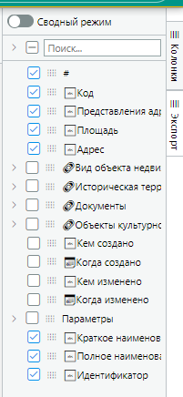{width="4.704861111111111in"
height="2.5694444444444446in"}После клика курсором в поле «Логин»
следует ввести логин кнопками на клавиатуре.

2)  Ввод пароля (Рис. 3).

После ввода логина пользователя, необходимо ввести пароль пользователя в
поле «Пароль» с учётом регистра. Для перехода с поля «пользователь» в
поле «пароль» можно использовать клавишу Tab на клавиатуре.

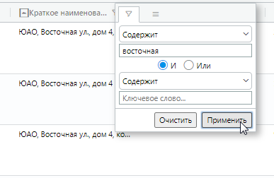{width="4.135416666666667in"
height="2.8291666666666666in"}

3)  Вход в систему, завершение авторизации (Рис. 4).

После выбора логина пользователя и ввода пароля для завершения
авторизации и входа в систему необходимо нажать на кнопку «Подключиться»
левой кнопкой «мышки» или клавишу «Enter» на клавиатуре.

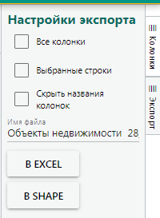{width="4.704861111111111in"
height="2.7909722222222224in"}

При успешной авторизации открывается главное окно Системы (Рис. 6).

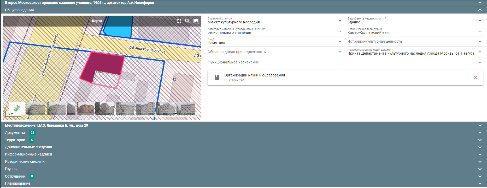{width="4.704861111111111in"
height="2.8291666666666666in"}При неудачной авторизации, появится
информационное окно с текстом «Неверный логин и пароль» (Рис. 5).

Для входа в веб-приложение требуется подключение к локальной сети
Мосгорнаследия. В командной строке браузера зайти на адрес
[http://mgn.mos.ru/]{.underline} и в окно авторизации (Рис. 6) вести
индивидуальный логин и пароль, нажать «Подключить».

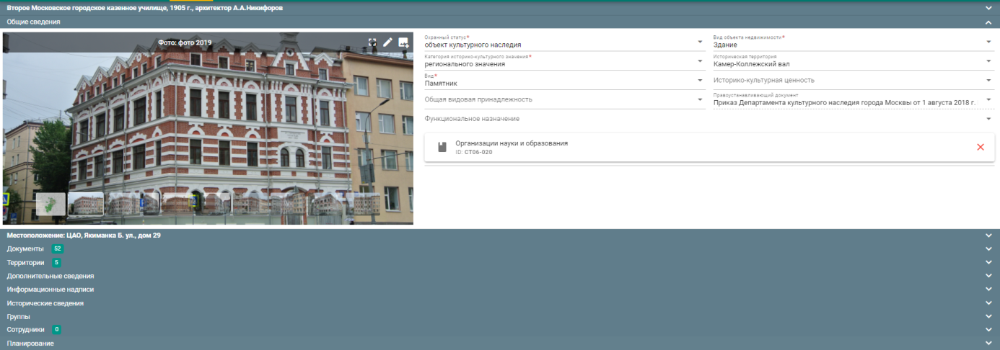{width="6.069444444444445in"
height="5.3180555555555555in"}

В случае обновления Системы после последнего входа в Систему
пользователем после авторизации появляется информационное окно
«Уведомление об изменении версий» с кнопками «Закрыть» и «Что нового?».

При нажатии на кнопку «Что нового?» открывается Перечень изменений
Системы (Рис. 7) с подробным описанием изменений, номеров версий и даты
их опубликования.

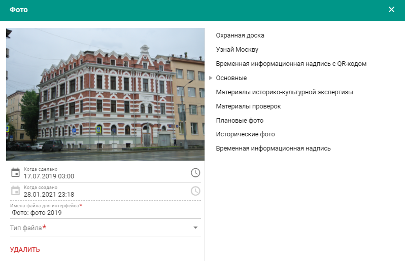{width="5.441666666666666in"
height="3.303472222222222in"}

Описание основных кнопок и их функций
-------------------------------------

Описание типовых кнопок, используемых на экранных формах Системы, а
также их функций приведено в таблице ниже (Табл. 2).

Таблица 2

**Описание типовых кнопок и их функций**

  -------------------------------------------------------------------------------------------------------------------------------------------------------------------------------------------------------- -----------------------------------------------------------------------------------------------
  Кнопка                                                                                                                                                                                                   Функции
  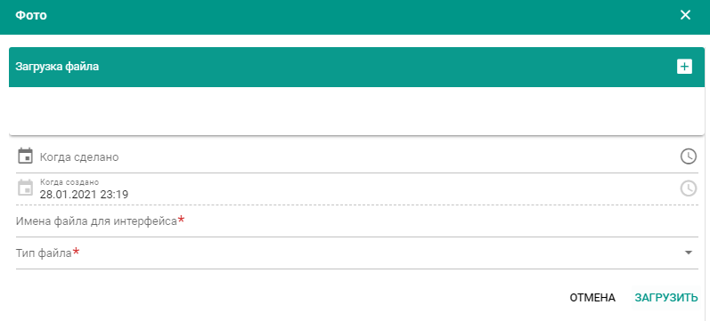                                                                                                                    Создать новый элемент справочника или новый документ
  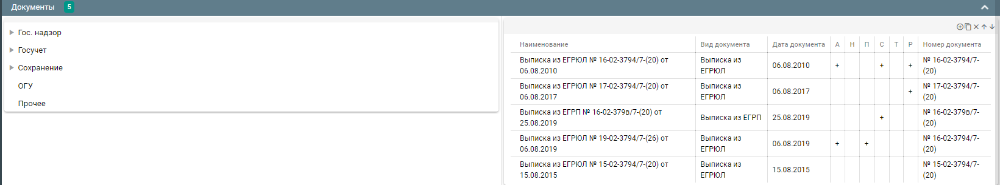                                                                                                      Вернуться на Главную страницу
  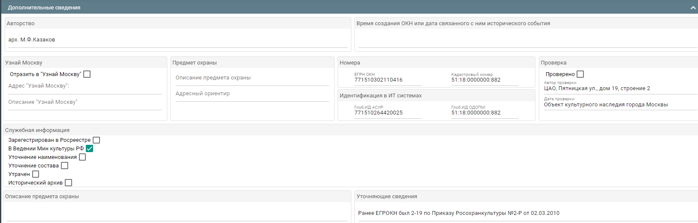                                                                                                      Скрыть/показать меню
  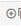                                                                                                      Выход из Системы
                                                                                                                                                                                                           Записать документ или элемент справочника (системой не инициируется переход на следующий шаг)
  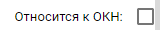                                                                                                      Найти объект культурного наследия
                                                                                                                                                                                                           Выбрать дату из календаря
  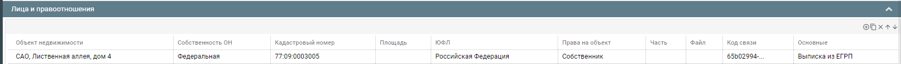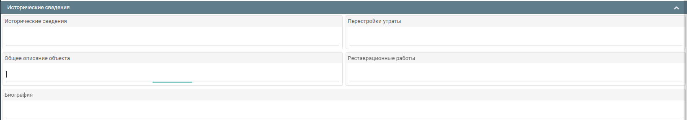   Вызов списка уведомлений/ Новое уведомление
                                                                                                                                                                                                           Вызов справки о программе
                                                                                                                                                                                                           Печать
  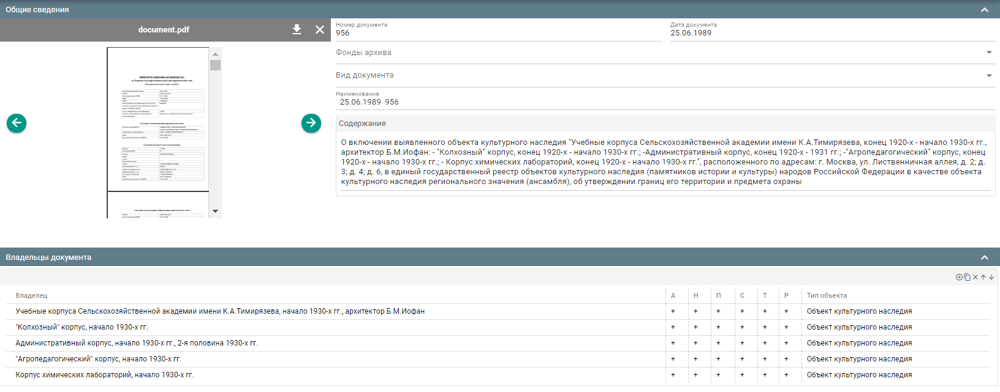                                                                                                      Просмотр карточки обращения
  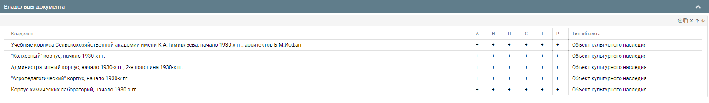                                                                                                     Назначение исполнителя
  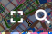                                                                                                     Формирование проекта документа
  -------------------------------------------------------------------------------------------------------------------------------------------------------------------------------------------------------- -----------------------------------------------------------------------------------------------

К данным всех Реестров Системы можно применить фильтры, сортировать. Для
установки фильтра требуется нажать на кнопку
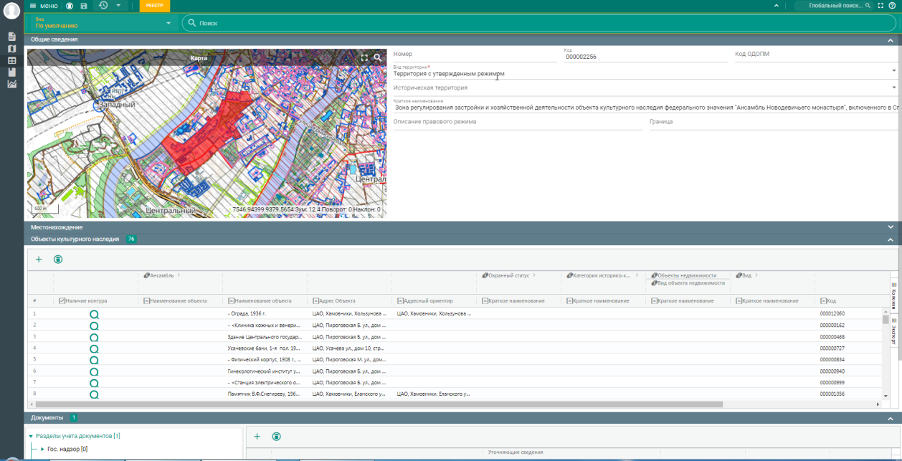{width="0.18611111111111112in"
height="0.22083333333333333in"} , в появившемся поле отобразится
установленный в настоящее время условие обзора (по умолчанию параметр
отбора не установлен (значение None).

При нажатии на строку с параметром отбора открывается меню с доступными
значениями фильтра:

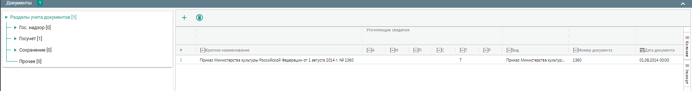{width="3.015972222222222in"
height="1.2381944444444444in"}

**Рис. 8.** Фильтр

1.  Все

2.  Пусто

3.  Не пусто

4.  Равен

5.  Неравен

6.  Начинается с

7.  Заканчивается на

8.  Содержит

9.  Не содержит.

При выборе параметров 4-9 выводится поле для ввода значения параметра
фильтрации

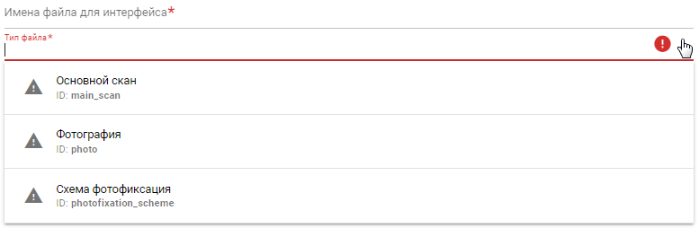{width="1.525in"
height="1.35625in"}

**Рис. 9.** Параметры фильтрации

Элементы ввода типовых данных и справочники
-------------------------------------------

Поля, подразумевающие справочные данные (адреса, названия, юр.лица и
т.д.), или набор типовых вариантов выбора (статусы документов, типы из
классификатора и подобное).

{width="3.892361111111111in"
height="0.6861111111111111in"}

или

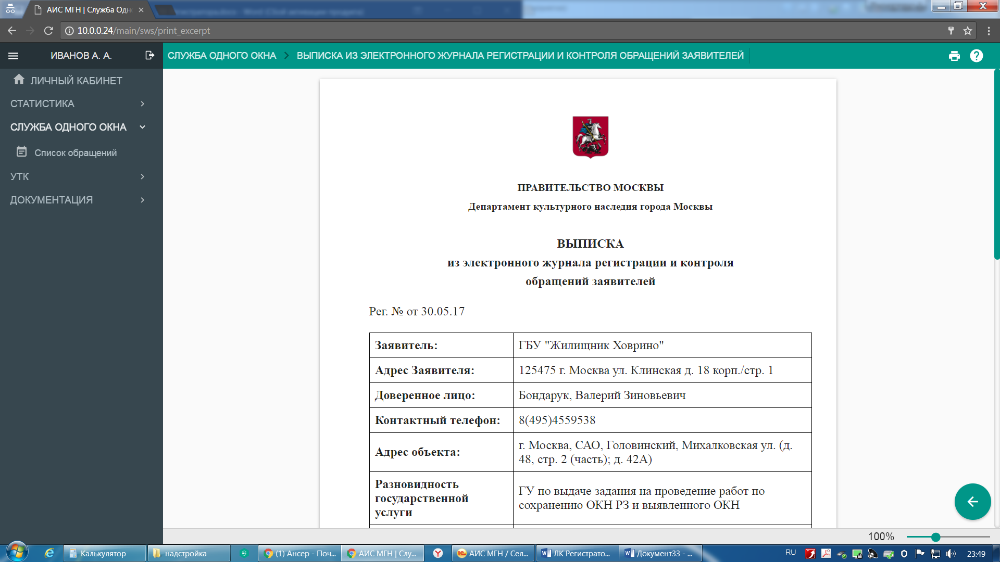{width="4.440972222222222in"
height="0.6277777777777778in"}

при клике раскрываются в выпадающий список.

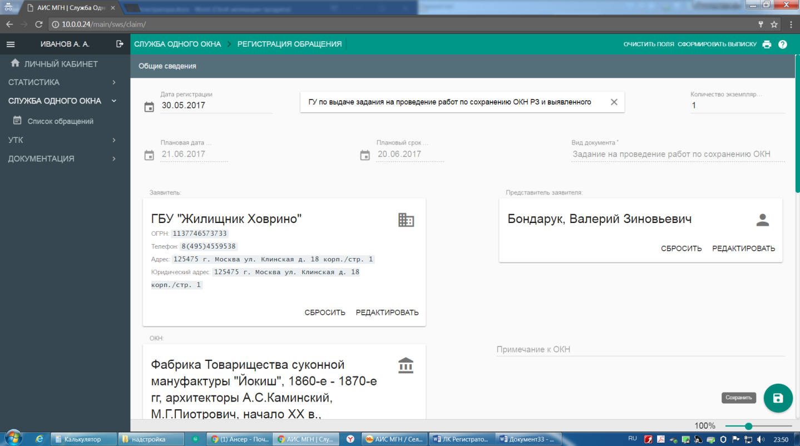{width="2.7125in"
height="2.060416666666667in"}

**Рис. 10.** Выпадающий список

По мере ввода текста в строку, пользователю предлагается список с
подходящим по условиям позиции.

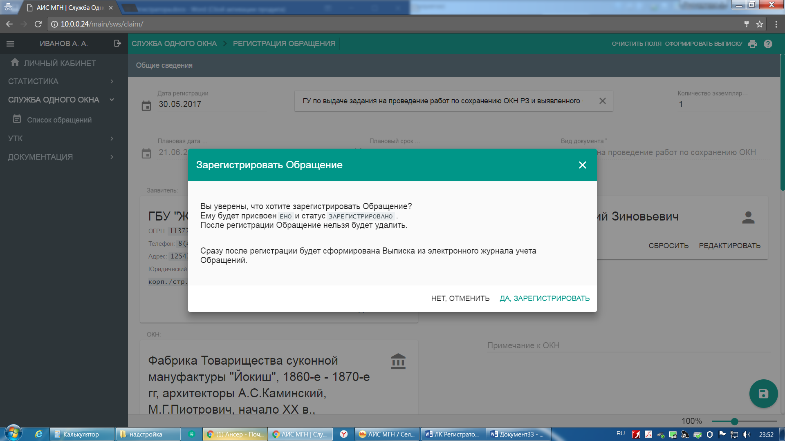{width="5.622222222222222in"
height="2.1243055555555554in"}

**Рис. 11.** Выпадающий список при поиске ОКН

**Поиск ОКН происходит не только по адресу и наименованию ОКН, также в
результаты будут включены позиции с совпадениями в характеристиках
ОКН.**

Обязательные поля для заполнения поля маркируются символом \"\*\"
(звездочка) в конце названия поля. В случае незаполненного обязательного
поля, оно будет подсвечено красной обводкой.

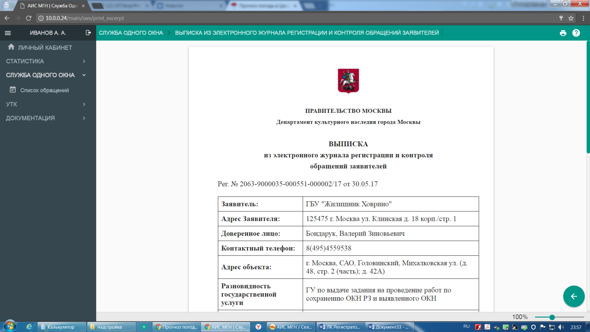{width="4.440972222222222in"
height="0.6277777777777778in"}

**Рис. 12.** Обязательное для заполнения поле

В случае наличия в документе или карточке связанных полей при выборе
элемента из списка такие поля заполняются автоматически.

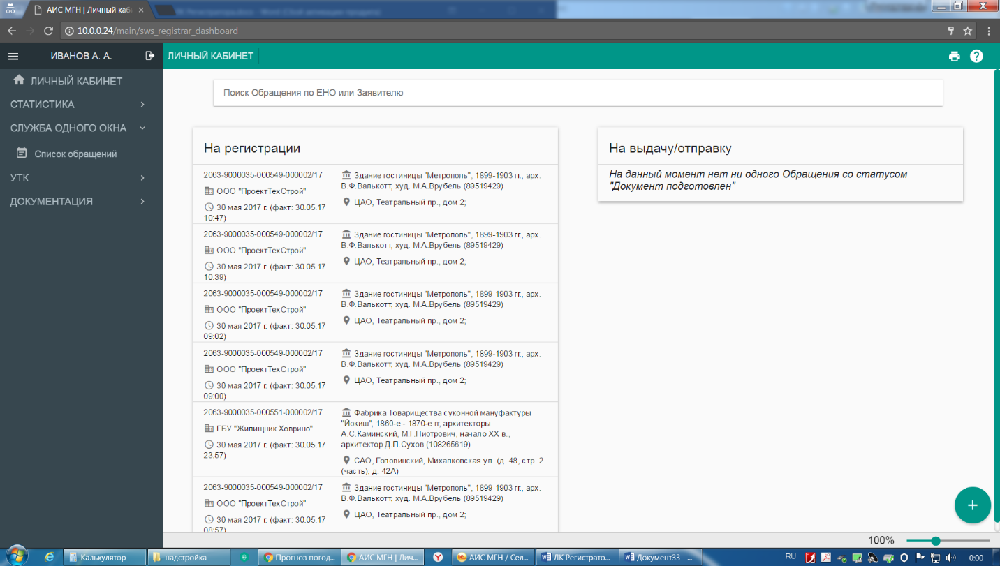{width="4.424305555555556in"
height="3.652083333333333in"}

**Рис. 13.** Автоматическое заполнение обязательных полей

Возможны ситуации изменения обязательности заполнения связанных полей
при выборе разных типов объектов недвижимости, примером может служить
запрос выписки из ЕГРП, при выборе типа строения будет меняться набор
необходимых полей, что однозначно идентифицируют адрес в ЕГРП.

Описание текстового редактора разрабатываемых документов
--------------------------------------------------------

При работе с типовой формой документа при установке курсора в
пространство листа документа доступна панель инструментов текстового
редактора, расположенного над текстовой частью документа.

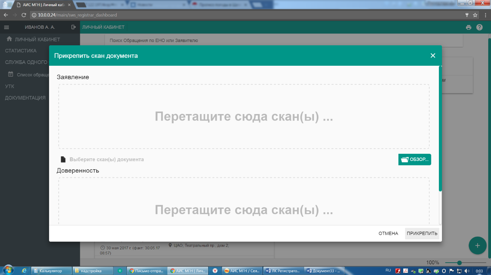{width="6.8909722222222225in"
height="0.27569444444444446in"}

**Рис. 14.** Панель инструментов текстового редактора

Описание кнопок панели инструментов:

{width="0.48680555555555555in"
height="0.2777777777777778in"} Вернуть/Отменить

{width="0.6604166666666667in"
height="0.2604166666666667in"}Вырезать/Копировать/Вставить

{width="0.6in"
height="0.26944444444444443in"} Шрифт жирный, курсив, с подчеркиванием

Форматирование текста:

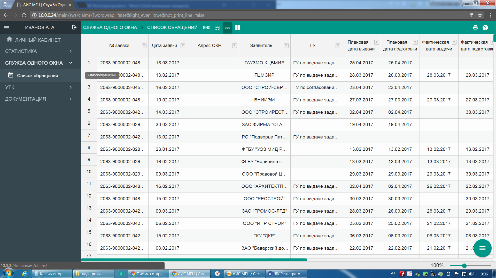{width="1.854861111111111in"
height="1.3520833333333333in"}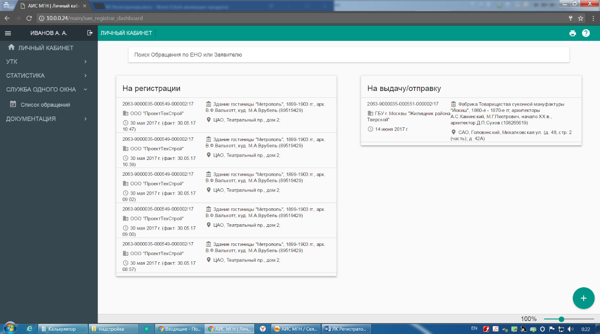{width="2.34375in"
height="1.3333333333333333in"}

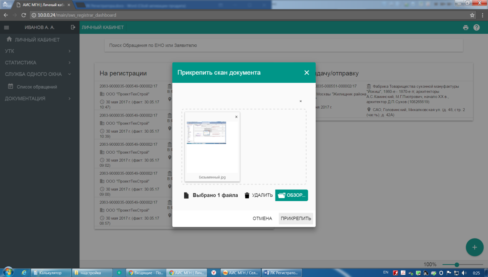{width="1.6701388888888888in"
height="1.4027777777777777in"}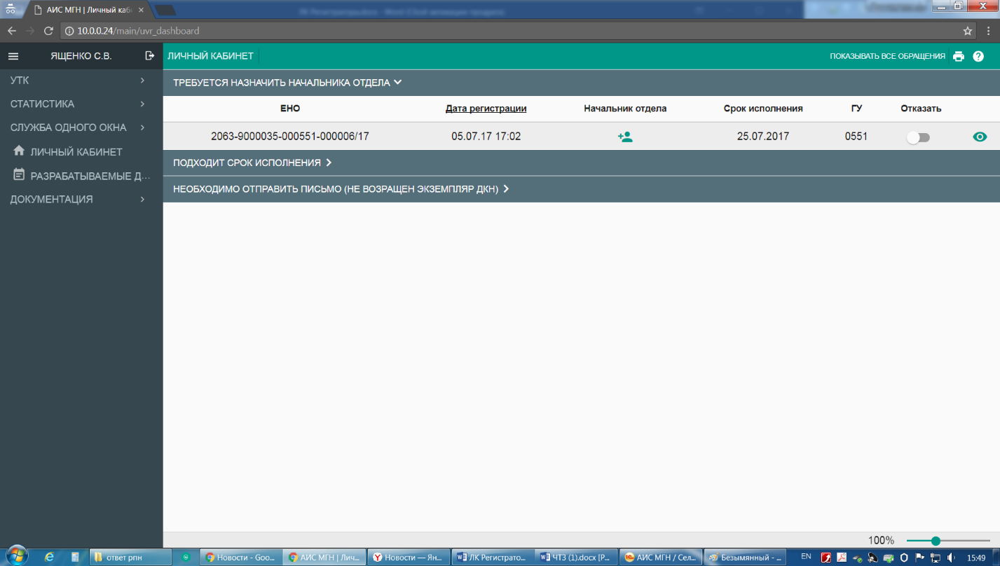{width="1.6479166666666667in"
height="0.8291666666666667in"}

**Рис. 15.** Форматирование документа

{width="0.23819444444444443in"
height="0.28680555555555554in"} Очистить формат

{width="0.5340277777777778in"
height="0.19305555555555556in"} Коррекция предлогов, дефисов и дат

{width="1.104861111111111in"
height="0.19305555555555556in"} Выравнивание по правому краю/центру/
левому краю/ ширине/ по ширине заполнить

{width="0.6in"
height="0.15902777777777777in"}Неразрывный пробел/ дефис/ тире

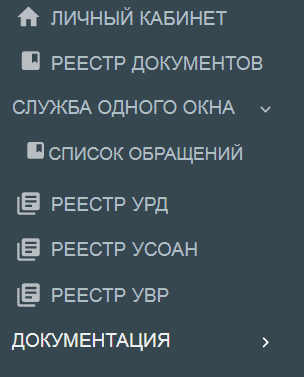{width="0.24722222222222223in"
height="0.2590277777777778in"} Изменить регистр

{width="0.46944444444444444in"
height="0.19722222222222222in"} Нумерованный / маркированный список

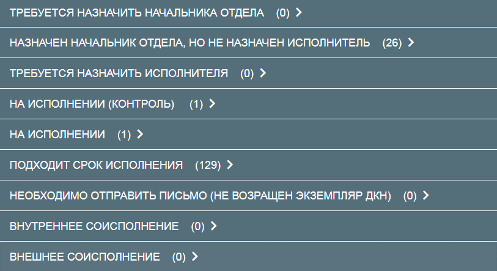{width="2.033333333333333in"
height="1.9388888888888889in"}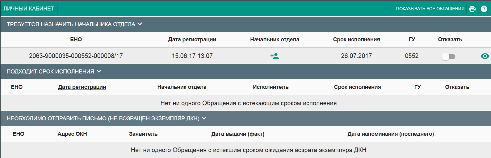{width="2.0409722222222224in"
height="1.9368055555555554in"}

**Рис.16.** Форматирование текста

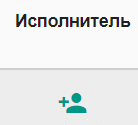{width="0.8638888888888889in"
height="0.3951388888888889in"} Уменьшить/ увеличить отступ

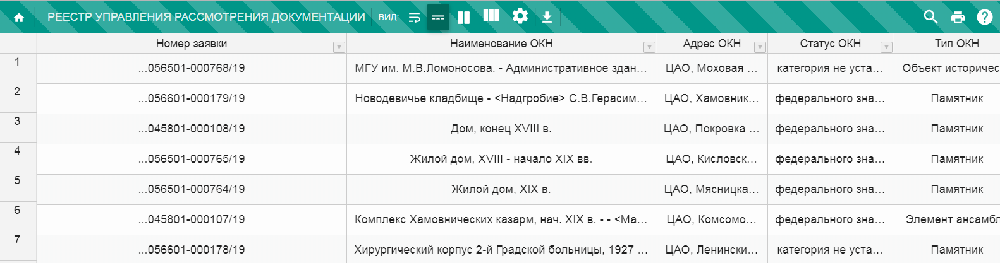{width="1.7159722222222222in"
height="1.6118055555555555in"}

**Рис. 17.** Вставить дату/ время

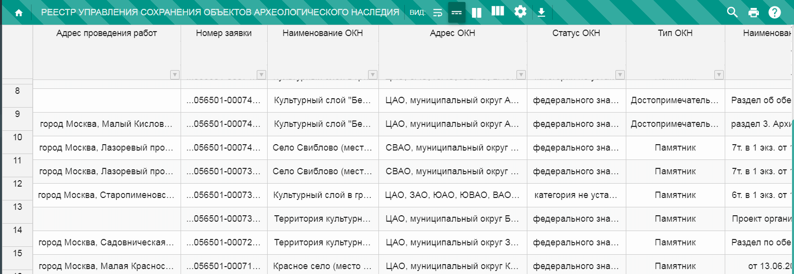{width="3.040277777777778in"
height="2.0347222222222223in"}

**Рис. 18.** Вставить таблицу

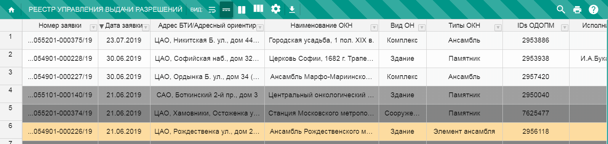{width="0.4576388888888889in"
height="0.40555555555555556in"}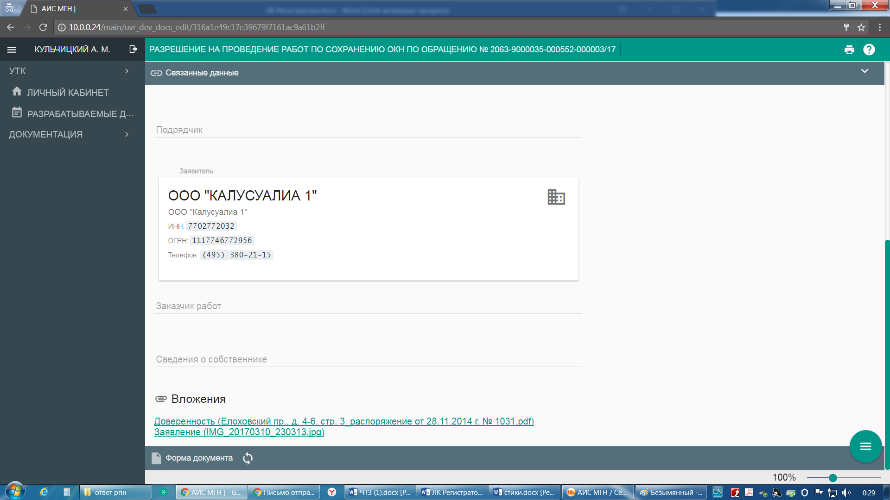{width="3.6569444444444446in"
height="1.7465277777777777in"}

**Рис. 19.** Поиск и замена

В режиме редактирования текста документа доступен функционал текстового
редактора с помощью следующих горячих клавиш:

-   Отмена действия - Ctrl + Z

-   Возврат отмененного действия - Ctrl + Y

-   Переключение выделенного текста между жирным и простым начертанием
    - Сtrl + B

-   Переключение текста между курсивом и простым начертанием - Сtrl + I

-   Включение/отключение подчеркивания выделенного текста - Сtrl + U

-   Вставка мягкого переноса на следующую строку - Shift + Enter

-   Принудительные разрывы в режиме редактирования (перенос текста за
    курсором в новый абзац) - Ctrl + Enter

Все внесенные изменения в режиме редактирования могут сброшены до
состояния первоначального шаблона нажатием кнопки »Обновить».
