---
tags:
  - subsystem
---
Подсистема «Государственные услуги»
===================================

Подсистема обеспечивает оказание Государственных услуг (ОГУ) населению,
осуществляемых ДКН в целях реализации задач по сохранению ОКН.

В общем, оказание любой ГУ сводится к:

-   принятию заявки (обращения) на ОГУ от заявителя;

-   разработке затребованного документа;

-   выдаче затребованного документа.

Работа с обращением заявителя за ГУ начинается с регистрации сотрудником
службы «Одного окна» заявления в Личном кабинете (ЛК) Регистратора.

Руководство пользователя ЛК Регистратора.
-----------------------------------------

Для осуществления входа в ЛК Регистратора требуется при наличии
подключения к локальной сети Мосгорнаследия в командной строке браузера
зайти на адрес [http://mgn.mos.ru/]{.underline} и в окно авторизации
(Рис. 48) вести индивидуальный логин и пароль, нажать «Подключить».

{width="2.3020833333333335in"
height="1.2555555555555555in"}

**Рис. 48.** Окно авторизации

После идентификации пользователя выполняется авторизация в ЛК
Регистратора в Подсистеме (Рис. 49).

{width="6.0465277777777775in"
height="0.7555555555555555in"}

**Рис. 49.** ЛК Регистратора

Меню ЛК Регистратора располагается слева и содержит разделы:

ЛИЧНЫЙ КАБИНЕТ.

Содержит подразделы: На регистрацию; На выдачу/отправку, строку поиска
обращения по ЕНО или Заявителю и кнопку «Регистрация обращений»
{width="0.48819444444444443in"
height="0.48819444444444443in"}

СЛУЖБА ОДНОГО ОКНА содержит список всех обращений на оказание ГУ,
поступивших в Мосгорнаследие.

**Рис. 50.** Применение фильтра

Для регистрации нового обращения требуется нажать кнопку с плюсом,
расположенную в разделе ЛК Регистратора в левом нижнем
углу.{width="1.8840277777777779in"
height="0.5465277777777777in"}

Открывается карточка обращения (Рис. 51).

{width="5.41875in"
height="3.115972222222222in"}

**Рис. 51.** Карточка обращения

Она содержит разделы:

1.  Общие сведения

2.  Документы

3.  Поручение.

Раздел общие сведения содержит поля:

-   Дата регистрации,

-   Запрашиваемая ГУ

-   Плановая дата

-   Плановый срок

-   Количество экземпляров,

-   Вид документа

-   Заявитель,

-   Представитель Заявителя

-   Объект культурного наследия,

-   Примечание к ОКН.

Поле Дата регистрации заполняется автоматически по текущей дате, поле
Плановая дата и Плановый срок устанавливаются в соответствии с
регламентными сроками оказания ГУ Мосгорнаследием (Рис. 52).

{width="3.604861111111111in"
height="1.1159722222222221in"}

**Рис. 52.** Автозаполнение полей с датами

Первоначально требуется в поле Запрашиваемая ГУ выбрать из справочника
вид ГУ, оказываемых Мосгорнаследием (Рис. 53).

{width="2.720833333333333in"
height="1.2555555555555555in"}

**Рис. 53.** Справочник видов ГУ

После выбора вида ГУ автоматически заполняется поле Вид документа и
появляется список документов, соответствующий регламенту оказания
выбранной ГУ (Рис. 54):

{width="5.686111111111111in"
height="1.7555555555555555in"}

**Рис. 54.** Список документов

Обязательные для внесения при регистрации обращения документы отмечены
\*, остальные документы являются необязательными, в случае отсутствия их
у Заявителя они удаляются из перечня, нажатием на иконку «Корзина»
{width="0.3951388888888889in"
height="0.5118055555555555in"}.

Для заполнения полей Заявитель и Представитель заявителя требуется
выбрать значение из справочника Базового регистра, в котором содержится
информация о юридических и физических лица, когда-либо обращавшихся за
оказанием Госуслуг. При вводе ключевой фразы для поиска. Подсистема
предлагает имеющиеся варианты:

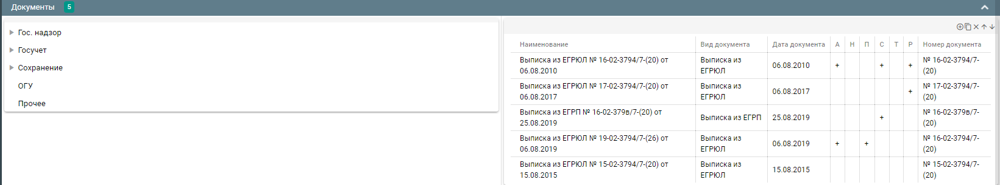{width="3.8604166666666666in"
height="1.395138888888889in"}

**Рис. 55.** Ввод ключевой фразы для поиска заявителя

В случае отсутствия в справочнике информации, соответствующей запросу,
выводится сообщение «Заявитель не найден». Требуется дополнить
справочник, используя кнопки «+ОРГАНИЗАЦИЮ» и «+ФИЗ.ЛИЦО».

{width="3.6395833333333334in"
height="0.8951388888888889in"}

**Рис. 56.** Дополнение справочника

При нажатии открывается карточка организации или физ. лица.

Поля, отмеченные «\*» являются обязательными для заполнения.

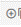{width="4.511805555555555in"
height="3.441666666666667in"}

**Рис.57.** Создание организации

{width="4.4534722222222225in"
height="3.4069444444444446in"}

**Рис. 58.** Создание физ. лица

Значения, введенные в поля ИНН, ОГРН, СНИЛС проходят верификацию в АСУР
ИСИ.

При добавлении новых юридических и физических лиц после внесения
действующих СНИЛС, ИНН, ОГРН остальные поля заполняются автоматически
(Рис. 59).

Поля карточек заполняются Регистратором в соответствии с
предоставленными документами. После внесения информации требуется нажать
кнопку Сохранить.

Если обязательные поля не заполнены, то карточка не сохранится, а пустые
поля подсветятся красным.

{width="4.011805555555555in"
height="0.9881944444444445in"}

**Рис. 59.** Проверка на заполнение обязательных полей

После заполнения всех обязательных полей карточка сохраняется. В случае
ошибочного выбора, требуется нажать кнопку Сбросить. Если сведения АСУР
ИСИ не соответствуют предоставленным документам, данные редактируются.
(Рис. 60)

{width="4.895138888888889in"
height="2.279166666666667in"}

**Рис. 60.** Редактирование данных заявителя

Сведения об объекте, по которому требуется получение ГУ, вносятся в поле
«Объект культурного наследия» (Рис. 61), путем выбора объекта из
Городского реестра недвижимого культурного наследия города Москвы.
Полнотекстовый поиск выполняется по наименованию ансамбля, объекта,
адреса БТИ. Соответствие запроса и найденных сведений подсвечивается
желтым цветом. (Рис. 62)

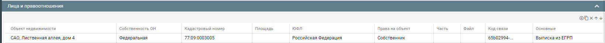{width="3.6395833333333334in"
height="1.3722222222222222in"}

**Рис.61.** Поле ОКН

**Рис. 62.** Соответствие запроса и найденных сведений

Если ИКЗ выбранного ОКН не соответствует выбранной ГУ, то появится
сообщение, предупреждающее об этом.

{width="4.058333333333334in"
height="1.08125in"}

**Рис. 63.** Сообщение о несоответствие ИКЗ выбранного ОКН

Регистратору следует проверить выбор объекта, т.к. по одному адресу
возможно расположение нескольких ОКН с разными категориями
историко-культурного значения. Также встречаются ОКН с одинаковыми
наименованиями.

Если в момент регистрации обращения Регистратор не смог найти ОКН, по
которому требуется оказать ГУ, то в поле «Примечание к ОКН» вносится
информация об объекте, указанная в обращении, для идентификации ОКН
ответственным исполнителем, а в поле Объект культурного наследия
вносится любой объект из списка, т.к. поле является обязательным для
заполнения.

{width="1.5055555555555555in"
height="0.8513888888888889in"}

**Рис. 64.** Примечание к ОКН

В разделе «Документы» Регистратором заполняются атрибуты документов в
следующих полях:

Вид документа (заполнено в соответствии с регламентом оказания ГУ)

-   Подтип

-   Номер

-   Дата

-   Срок действия

-   Кем выдан (подписан)

-   Кол-во листов

-   Дата выдачи

-   Кол-во экз.

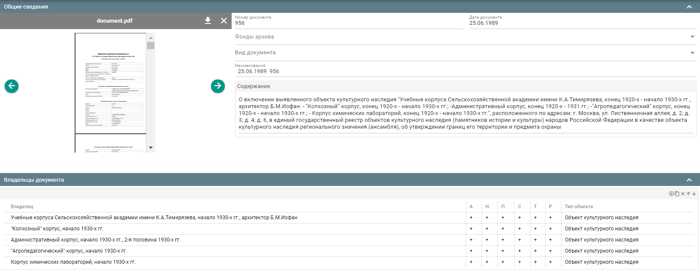{width="6.697916666666667in"
height="3.767361111111111in"}

**Рис. 65.** Раздел Документы

Дата заполняется как вручную, так путем выбора из календаря.

{width="1.9416666666666667in"
height="1.4416666666666667in"}

**Рис. 66.** Выбор даты из календаря

Допускается заполнение одного из полей «Дата» или «Дата выдачи».

Если документ не является обязательным и не предоставляется Заявителем,
он удаляется нажатием на иконку мусорной
корзины{width="0.4534722222222222in"
height="0.4534722222222222in"}.

В случае, если документ, подаваемый Заявителем, отсутствует в списке,
его возможно добавить кнопкой «+Добавить документ».
{width="1.9416666666666667in"
height="0.3486111111111111in"}

При нажатии на данную кнопку открывается и заполняется карточка
документа.

{width="5.086805555555555in"
height="1.5819444444444444in"}

**Рис. 67.** Редактирование документа

Вид документа выбирается из справочника. Справочник является
пополняемым: Регистратор может добавить новый вид документа.

{width="3.1979166666666665in"
height="1.9881944444444444in"}

**Рис. 68.** Пополняемый справочник вида документа

Остальные поля заполняются вручную или выбирается из календаря (дата).
При необходимости нажатием на иконку «Документ принят по просьбе
Заявителя»
{width="2.279166666666667in"
height="0.2791666666666667in"}устанавливается данный признак документа.
После заполнения полей карточки, данные сохраняются. Незаполненные
обязательные поля подсвечиваются красным, сохранение не выполняется до
их внесения.

В разделе «Поручение» назначаются Ответственный исполнитель (по
умолчанию -- Ященко) и при необходимости соисполнитель (выбираются из
списка сотрудников Мосгорнаследия).

{width="4.395138888888889in"
height="2.0118055555555556in"}

**Рис. 69.** Назначение ответственного исполнителя

Для проверки обращения перед регистрацией рекомендуется предварительно
сформировать проект заявки, используя кнопку «Сформировать выписку».

{width="2.3375in"
height="0.3840277777777778in"}

**Рис. 70.** Сформировать выписку

Формируется выписка, проверяются внесенные данные и реквизиты
документов.

**Рис. 71.** Проект выписки

Кнопка вернуться
{width="0.48819444444444443in"
height="0.44166666666666665in"} возвращает к Регистрации обращения для
внесения изменений. Если редактирование заявки не требуется, заявка
может быть зарегистрирована или отменена.

После нажатии кнопки «Сохранить»
{width="0.7444444444444445in"
height="0.7909722222222222in"} появится сообщение о завершении процедуры
регистрации. После регистрации внести изменения в Обращение невозможно.

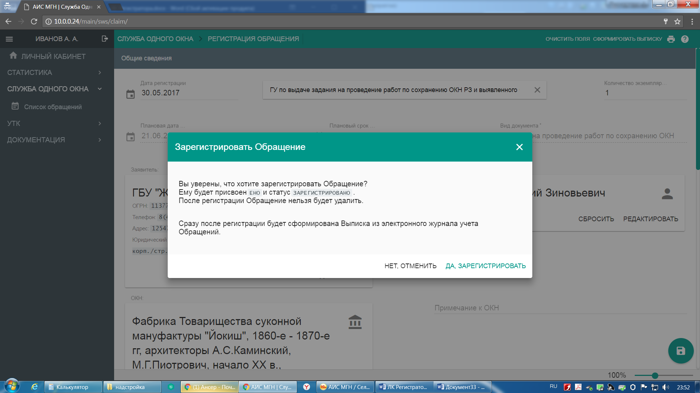{width="3.941666666666667in"
height="1.5118055555555556in"}

**Рис. 72.** Подтверждение регистрации обращения

Обращению присваивается статус «зарегистрировано», формируется форма с
автоматически присвоенным номером, с возможностью печати для выдачи
Заявителю на руки для визирования.

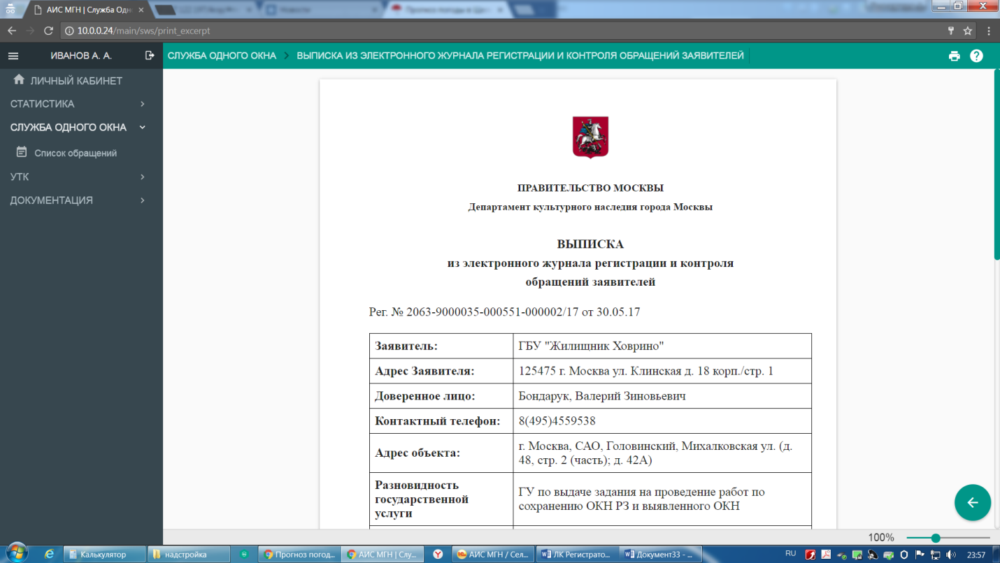

**Рис. 73.** Выписка

Зарегистрированное обращение размещается в ЛК Регистратора в разделе «На
регистрацию» для прикрепления обязательных отсканированных электронных
образов документов.

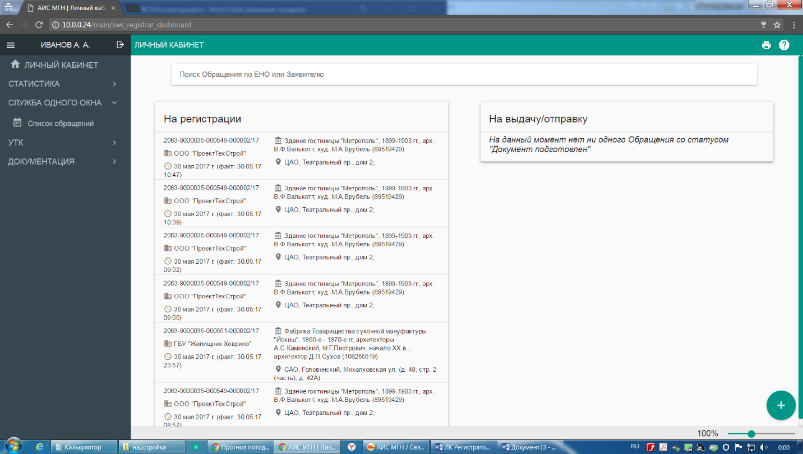{width="6.5in"
height="1.2208333333333334in"}

**Рис. 74.** На регистрации

Щелкнув по строке с реквизитами Обращения открывается окно для
добавления файлов отсканированных обязательных документов.

{width="5.186111111111111in"
height="2.604861111111111in"}

**Рис. 75.** Прикрепление электронной версии документа

После нажатия кнопки «Прикрепить» Обращение становится доступным в
разделе «Служба одного окна» в Списке обращений и направляется в ЛК
Ответственного исполнителя для дальнейшей работы.

{width="6.5in"
height="3.279166666666667in"}

**Рис. 76.** Список обращений

Далее производится разработка затребованного документа в соответствии с
регламентами Мосгорнаследия или обоснованного отказа в предоставлении
ГУ.

После завершения разработки документа Исполнителем, документ готовится к
выдаче Заявителю. Получив подписанный затребованный документ Регистратор
фиксирует его в Канцелярии ДКН и извещает заявителя о готовности
документа.

Затребованный документ появляется в ЛК Регистратора в разделе «На
выдачу/отправку».

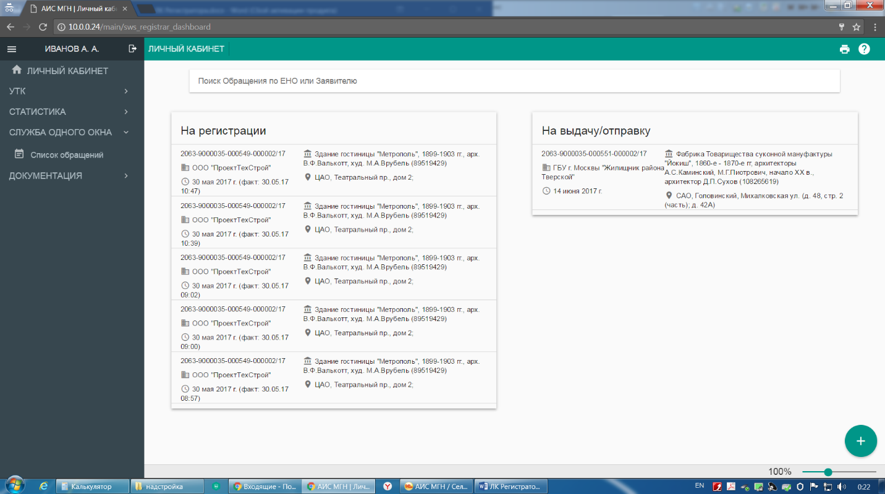{width="6.5in"
height="1.5694444444444444in"}

**Рис. 77.** На выдачу/отправку

При нажатии на строку с наименованием документа открывается окно для
прикрепления электронной версии готового документа. (Рис. 78)

{width="1.895138888888889in"
height="2.115972222222222in"}

**Рис. 78.** Прикрепление электронной версии готового документа

Регистратор прикрепляет к карточке Обращения скан зарегистрированного
документа. После вручения документа Заявителю, регистратор проставляет
«Дату вручения», а Обращению автоматически присваивается статус
«закрыто».

Руководство пользователя ЛК Начальника УВР
------------------------------------------

Этап разработки затребованного в рамках ОГУ документа начинается с
назначения начальника отдела УВР в ЛК Начальника УВР.

Для осуществления подключения требуется ввести индивидуальный логин и
пароль, (Рис. 79) нажать «Подключить».

{width="2.3020833333333335in"
height="1.2555555555555555in"}

**Рис. 79.** Подключение к базе данных

После идентификации пользователя выполняется авторизация в ЛК Начальника
УВР.

{width="6.41875in"
height="1.0930555555555554in"}

**Рис. 80.** ЛК Начальника УВР

Меню ЛК Начальника УВР содержит разделы:

-   Личный кабинет

-   Реестр документов

-   Служба одного окна:

    -   Список обращений

-   Реестр УРД

-   Реестр УСОАН

-   Реестр УВР

-   Документация:

    -   Что нового?

{width="2.1333333333333333in"
height="2.645138888888889in"}

**Рис. 81.** Меню

Личный кабинет состоит из разделов (Рис. 82):

-   Требуется назначить начальника отдела.

-   Подходит срок исполнения.

-   Назначен начальник отдела, но не назначен исполнитель.

-   Требуется назначить исполнителя.

-   На исполнении (контроль).

-   На исполнении.

-   Подходит срок исполнения.

-   Необходимо отправить письмо (не возвращен экземпляр ДКН).

-   Внутреннее соисполнение.

-   Внешнее соисполнение.

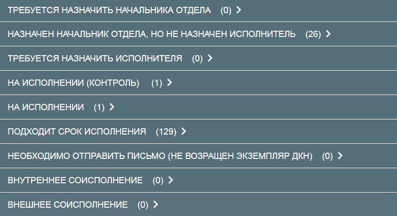{width="4.699305555555555in"
height="2.560416666666667in"}

**Рис. 82.** Разделы личного кабинета

В разделе «Требуется назначить начальника отдела» отображаются
уведомления о регистрации нового обращения, в ЛК появляется
соответствующая запись со сроками исполнения и ссылкой на карточку
обращения. На данном этапе Обращению присваивается статус «на
исполнении».

> В данном разделе доступны:

-   Просмотр карточки обращения
    {width="0.5in"
    height="0.3951388888888889in"}.

При нажатии на кнопку открывается Регистрационная карточка обращения с
прикрепленными отсканированными копиями документов

-   Инициирование процедуры отказа в предоставлении ГУ
    {width="0.7444444444444445in"
    height="0.58125in"}.

Для отказа требуется переместить маркер вправо, поле выделится красным.

-   Назначение начальника отдела, ответственного за оказание ГУ
    {width="1.1513888888888888in"
    height="0.5694444444444444in"}

Сотрудник выбирается из справочника должностных лиц Мосгорнаследия.

-   Назначение исполнителя, ответственного за оказание ГУ
    {width="0.8194444444444444in"
    height="0.7416666666666667in"}

Исполнитель выбирается из справочника должностных лиц Мосгорнаследия.

В разделе «Назначен начальник отдела, но не назначен исполнитель»
отображаются уведомления о регистрации нового обращения, в ЛК появляется
соответствующая запись со сроками исполнения и ссылкой на карточку
обращения. На данном этапе Обращению присваивается статус «на
исполнении».

В данном разделе доступны:

-   Просмотр карточки обращения
    {width="0.5in"
    height="0.3951388888888889in"}.

При нажатии на кнопку открывается Регистрационная карточка обращения с
прикрепленными отсканированными копиями документов

-   Инициирование процедуры отказа в предоставлении ГУ
    {width="0.7444444444444445in"
    height="0.58125in"}.

Для отказа требуется переместить маркер вправо, поле выделится красным.

В разделе «На исполнении (контроль)» отображаются все обращения на
исполнении в УВР со сроками исполнения и ссылкой на карточку обращения.

В данном разделе доступны:

-   Просмотр карточки обращения
    {width="0.5in"
    height="0.3951388888888889in"}.

При нажатии на кнопку открывается Регистрационная карточка обращения с
прикрепленными отсканированными копиями документов

-   Инициирование процедуры отказа в предоставлении ГУ
    {width="0.7444444444444445in"
    height="0.58125in"}.

Для отказа требуется переместить маркер вправо, поле выделится красным.

В разделе «На исполнении» отображаются все обращения, в которых
авторизированный пользователь назначен Исполнителем со сроками
исполнения и ссылкой на карточку обращения.

В данном разделе доступны:

-   Просмотр карточки обращения
    {width="0.5in"
    height="0.3951388888888889in"}.

При нажатии на кнопку открывается Регистрационная карточка обращения с
прикрепленными отсканированными копиями документов

-   Инициирование процедуры отказа в предоставлении ГУ
    {width="0.7444444444444445in"
    height="0.58125in"}.

Для отказа требуется переместить маркер вправо, поле выделится красным.

В разделе «Подходит срок исполнения» отображаются обращения, срок
подготовки которых истекает. Желтым цветом помечаются документы, у
которых 5 дней до конца срока, красным -- 3 дня, черным (серым) --
просроченные.

В разделе «Необходимо отправить письмо (не возвращен экземпляр ДКН)»
отображаются обращения на задание на проведение работ по сохранению ОКН,
в рамках исполнения которых задание было отправлено на согласование
Заявителю, но экземпляр согласованного задания в Департамент не
возвращен.

В разделе «Внутреннее соисполнение» отображаются все обращения, в
которых авторизированный пользователь назначен соисполнителем со сроками
исполнения и ссылкой на карточку обращения.

В данном разделе доступны:

-   Просмотр карточки обращения
    {width="0.5in"
    height="0.3951388888888889in"}.

При нажатии на кнопку открывается Регистрационная карточка обращения с
прикрепленными отсканированными копиями документов

В разделе «Внешнее соисполнение» отображаются все обращения, в которых
авторизированный пользователь назначен внешним Соисполнителем со сроками
исполнения и ссылкой на карточку обращения.

В данном разделе доступны:

-   Просмотр карточки обращения
    {width="0.5in"
    height="0.3951388888888889in"}.

При нажатии на кнопку открывается Регистрационная карточка обращения с
прикрепленными отсканированными копиями документов

На вкладке «Реестр УРД» представлен перечень разрабатываемых документов
УРД в рамках ОГУ.

{width="6.497222222222222in"
height="1.7125in"}

**Рис. 83.** Реестр УРД

На вкладке «Реестр УСОАН» представлен перечень разрабатываемых
документов УСОАН в рамках ОГУ.

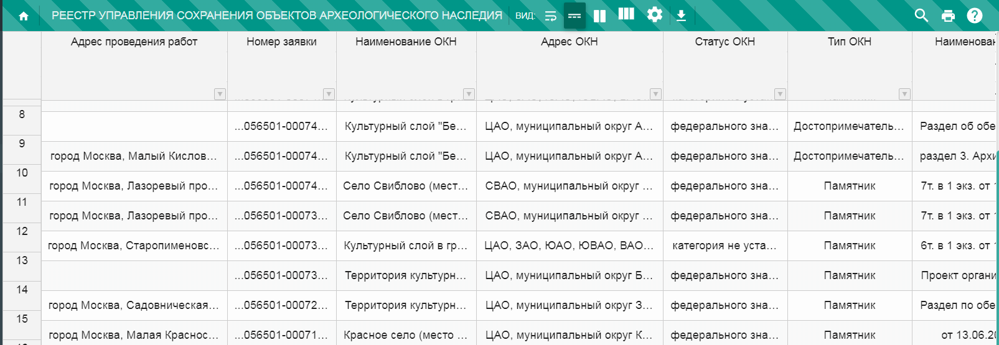{width="6.497222222222222in"
height="2.2465277777777777in"}

**Рис. 84.** Реестр УСОАН

На вкладке «Реестр УВР» представлен перечень разрабатываемых документов
УВР в рамках ОГУ.

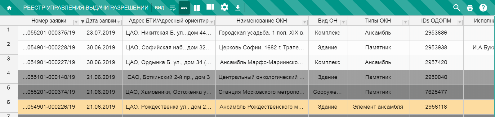{width="6.497222222222222in"
height="1.5430555555555556in"}

**Рис. 85.** Реестр УВР

К данным можно применить фильтры, сортировать. Для установки фильтра
требуется нажать на кнопку
{width="0.18611111111111112in"
height="0.22083333333333333in"} , в появившемся поле отобразится
установленный в настоящее время условие обзора.

После назначения в ЛК Ответственного исполнителя начальника отдела,
обращение переходит в ЛК Начальника отдела. В этот же момент в «Реестр
УВР» автоматически добавляется проект будущего документа.

Руководство пользователя ЛК Начальника отдела УВР
-------------------------------------------------

В ЛК Начальника отдела выполняется назначение исполнителя, контроль
сроков подготовки документов.

Для входа в ЛК Начальника отдела требуется ввести индивидуальный логин и
пароль, нажать «Подключить».

{width="2.3020833333333335in"
height="1.2555555555555555in"}

**Рис. 86.** Подключение к базе данных

После идентификации пользователя выполняется авторизация в ЛК Начальника
отдела УВР.

{width="6.41875in"
height="1.0930555555555554in"}

**Рис. 87.** Личный кабинет начальника отдела УВР

Меню ЛК Начальника отдела УВР содержит разделы:

-   Личный кабинет

-   Реестр документов

-   Служба одного окна:

    -   Список обращений

-   Реестр УРД

-   Реестр УСОАН

-   Реестр УВР

-   Документация:

    -   Что нового?

{width="2.1333333333333333in"
height="2.645138888888889in"}

**Рис. 88.** Меню

Личный кабинет состоит из разделов: (Рис. 89)

-   Требуется назначить исполнителя

-   На исполнении (контроль)

-   На исполнении

-   Подходит срок исполнения

-   Необходимо отправить письмо (не возвращен экземпляр ДКН).

-   Внутреннее соисполнение

-   Внешнее соисполнение

{width="4.699305555555555in"
height="2.0215277777777776in"}

**Рис. 89**. Разделы личного кабинета

Назначение исполнителя, ответственного за оказание ГУ
{width="0.8194444444444444in"
height="0.7416666666666667in"}

Исполнитель выбирается из справочника должностных лиц Мосгорнаследия.

В разделе «Требуется назначить исполнителя» отображаются уведомления о
регистрации нового обращения, в ЛК появляется соответствующая запись со
сроками исполнения и ссылкой на карточку обращения. На данном этапе
Обращению присваивается статус «на исполнении».

В данном разделе доступны:

-   Просмотр карточки обращения
    {width="0.5in"
    height="0.3951388888888889in"}.

    -   При нажатии на кнопку открывается Регистрационная карточка
        обращения с прикрепленными отсканированными копиями документов

-   Инициирование процедуры отказа в предоставлении ГУ
    {width="0.7444444444444445in"
    height="0.58125in"}.

Для отказа требуется переместить маркер вправо, поле выделится красным.

В разделе «На исполнении (контроль)» отображаются все обращения на
исполнении отдела УВР со сроками исполнения и ссылкой на карточку
обращения.

В данном разделе доступны:

-   Просмотр карточки обращения
    {width="0.5in"
    height="0.3951388888888889in"}.

    -   При нажатии на кнопку открывается Регистрационная карточка
        обращения с прикрепленными отсканированными копиями документов

-   Инициирование процедуры отказа в предоставлении ГУ
    {width="0.7444444444444445in"
    height="0.58125in"}.

Для отказа требуется переместить маркер вправо, поле выделится красным.

В разделе «На исполнении» отображаются все обращения, в которых
авторизированный пользователь назначен Исполнителем со сроками
исполнения и ссылкой на карточку обращения.

В данном разделе доступны:

-   Просмотр карточки обращения
    {width="0.5in"
    height="0.3951388888888889in"}.

    -   При нажатии на кнопку открывается Регистрационная карточка
        обращения с прикрепленными отсканированными копиями документов

-   Инициирование процедуры отказа в предоставлении ГУ
    {width="0.7444444444444445in"
    height="0.58125in"}.

Для отказа требуется переместить маркер вправо, поле выделится красным.

В разделе «Подходит срок исполнения» отображаются обращения, срок
подготовки которых истекает. Желтым цветом помечаются документы, у
которых 5 дней до конца срока, красным -- 3 дня, черным (серым) --
просроченные.

В разделе «Необходимо отправить письмо (не возвращен экземпляр ДКН)»
отображаются обращения на задание на проведение работ по сохранению ОКН,
в рамках исполнения которых задание было отправлено на согласование
Заявителю, но экземпляр согласованного задания в Департамент не
возвращен.

В разделе «Внутреннее соисполнение» отображаются все обращения, в
которых авторизированный пользователь назначен соисполнителем со сроками
исполнения и ссылкой на карточку обращения.

В данном разделе доступны:

-   Просмотр карточки обращения
    {width="0.5in"
    height="0.3951388888888889in"}.

При нажатии на кнопку открывается Регистрационная карточка обращения с
прикрепленными отсканированными копиями документов

В разделе «Внешнее соисполнение» отображаются все обращения, в которых
авторизированный пользователь назначен внешним Соисполнителем со сроками
исполнения и ссылкой на карточку обращения.

В данном разделе доступны:

-   Просмотр карточки обращения
    {width="0.5in"
    height="0.3951388888888889in"}.

При нажатии на кнопку открывается Регистрационная карточка обращения с
прикрепленными отсканированными копиями документов

На вкладке «Реестр УРД» представлен перечень разрабатываемых документов
УРД в рамках ОГУ.

{width="6.497222222222222in"
height="1.7125in"}

**Рис. 90.** Реестр УРД

На вкладке «Реестр УСОАН» представлен перечень разрабатываемых
документов УСОАН в рамках ОГУ.

{width="6.497222222222222in"
height="2.2465277777777777in"}

**Рис. 91.** Реестр УСОАН

На вкладке «Реестр УВР» представлен перечень разрабатываемых документов
УВР в рамках ОГУ.

{width="6.497222222222222in"
height="1.5430555555555556in"}

**Рис. 92.** Реестр УВР

После назначения в ЛК начальника отдела Исполнителя УВР, обращение
переходит в ЛК Исполнителя УВР.

Руководство пользователя ЛК Исполнителя УВР
-------------------------------------------

В ЛК Исполнителя УВР выполняется разработка документа.

Для осуществления подключения требуется ввести индивидуальный логин и
пароль, (Рис. 89) нажать «Подключить».

{width="2.3020833333333335in"
height="1.2555555555555555in"}

**Рис. 93.** Подключение к базе данных

После идентификации пользователя выполняется авторизация в ЛК
Исполнителя УВР.

{width="6.41875in"
height="1.0930555555555554in"}

**Рис 94.** ЛК Исполнителя УВР

Меню ЛК Исполнителя УВР содержит разделы:

-   Личный кабинет

-   Реестр документов

-   Служба одного окна:

    -   Список обращений

-   Реестр УРД

-   Реестр УСОАН

-   Реестр УВР

-   Документация:

    -   Что нового?

{width="2.1333333333333333in"
height="2.645138888888889in"}

**Рис. 95.** Меню

Личный кабинет состоит из разделов: (Рис. 96)

-   На исполнении

-   Подходит срок исполнения

-   Необходимо отправить письмо (не возвращен экземпляр ДКН).

-   Внутреннее соисполнение

-   Внешнее соисполнение

{width="4.699305555555555in"
height="1.4465277777777779in"}

**Рис. 96.** Разделы личного кабинета

В разделе «На исполнении» отображаются все обращения, в которых
авторизированный пользователь назначен Исполнителем со сроками
исполнения и ссылкой на карточку обращения.

В данном разделе доступны:

-   Просмотр карточки обращения
    {width="0.5in"
    height="0.3951388888888889in"}.

    -   При нажатии на кнопку открывается Регистрационная карточка
        обращения с прикрепленными отсканированными копиями документов

-   Инициирование процедуры отказа в предоставлении ГУ
    {width="0.7444444444444445in"
    height="0.58125in"}.

Для отказа требуется переместить маркер вправо, поле выделится красным.

В разделе «Подходит срок исполнения» отображаются обращения, срок
подготовки которых истекает. Желтым цветом помечаются документы, у
которых 5 дней до конца срока, красным -- 3 дня, черным (серым) --
просроченные.

В разделе «Необходимо отправить письмо (не возвращен экземпляр ДКН)»
отображаются обращения на задание на проведение работ по сохранению ОКН,
в рамках исполнения которых задание было отправлено на согласование
Заявителю, но экземпляр согласованного задания в Департамент не
возвращен.

В разделе «Внутреннее соисполнение» отображаются все обращения, в
которых авторизированный пользователь назначен соисполнителем со сроками
исполнения и ссылкой на карточку обращения.

В данном разделе доступны:

-   Просмотр карточки обращения
    {width="0.5in"
    height="0.3951388888888889in"}.

При нажатии на кнопку открывается Регистрационная карточка обращения с
прикрепленными отсканированными копиями документов

В разделе «Внешнее соисполнение» отображаются все обращения, в которых
авторизированный пользователь назначен внешним Соисполнителем со сроками
исполнения и ссылкой на карточку обращения.

В данном разделе доступны:

-   Просмотр карточки обращения
    {width="0.5in"
    height="0.3951388888888889in"}.

При нажатии на кнопку открывается Регистрационная карточка обращения с
прикрепленными отсканированными копиями документов

На вкладке «Реестр УРД» представлен перечень разрабатываемых документов
УРД в рамках ОГУ.

{width="6.497222222222222in"
height="1.7125in"}

**Рис. 97.** Реестр УВР

На вкладке «Реестр УСОАН» представлен перечень разрабатываемых
документов УСОАН в рамках ОГУ.

{width="6.497222222222222in"
height="2.2465277777777777in"}

**Рис. 98.** Реестр УСОАН

На вкладке «Реестр УВР» представлен перечень разрабатываемых документов
УВР в рамках ОГУ.

{width="6.497222222222222in"
height="1.5430555555555556in"}

**Рис. 99.** Реестр УВР

После назначения в ЛК начальника отдела, обращение переходит в ЛК
Исполнителя.

Разработка документа УВР
------------------------

Для разработки документа требуется в Личном кабинете исполнителя нажать
на строку с реквизитами обращения, по которому будет производиться
работа. Откроется карточка разрабатываемого документа, содержащая
разделы:

1.  Связанные данные

2.  Форма документа.

Раздел «Связанные данные» включает данные, которые поступают из карточки
обращения: ОКН, Примечание к ОКН, Заявитель, Вложения.

Часть полей заполняется автоматически из сведений, содержащихся в
Системе: Предыдущее обращение, Срок действия.

Поля Подрядчик, Заказчик, Сведения о собственнике заполняются значениями
из справочников, поиск осуществляется по наименованию, ИНН или ОГРН
организации или физ. лица.

Подраздел карточки разрабатываемого документа «Статистические данные»
заполняются вручную.

В разделе «Форма документа» по кнопке
{width="0.3138888888888889in"
height="0.41875in"} выполняется автоматическое формирование проекта
разрабатываемого документа согласно установленной форме.

Если по обращение принято решение об отказе, то при активном маркере
«Отказ» в разделе «Форма документа» будет сформировано письмо об отказе
установленного образца.

Поля сформированного документа являются редактируемыми и подлежат
заполнению. Часть данных загружается автоматически по наличию в Системе
и требует проверки.

**Рис. 100.** Карточка разрабатываемого документа

В левом нижнем углу карточки разрабатываемого документа расположено меню
«Действия» {width="0.41875in"
height="0.37222222222222223in"}.

При нажатии иконки становятся доступны функции:

{width="0.32222222222222224in"
height="0.3090277777777778in"}Открыть Обращение: при нажатии открывается
карточка обращения.

{width="0.3951388888888889in"
height="0.5694444444444444in"}Сохранить: сформированный документ с
внесенными и отредактированными данными сохраняется.

{width="0.5in"
height="0.5694444444444444in"}Завершить разработку: действие применяется
после согласования документа Ответственным исполнителем. Внести
изменения в разрабатываемый документ после осуществления действия
невозможно.

Далее готовый документ согласовывается с ответственным с возможностью
возврата с комментариями в поле «Комментарии к поручению».

После подписания документа ответственным исполнителем посредством
Электронной подписи, он автоматически передается в службу «Одно окно» в
электронном виде. Регистратор, занимающейся связанным с документом
Обращением, получает соответствующее уведомление в ЛК Регистратора.
Обращению присваивается статус «подготовлено».

Процесс согласования ПД
-----------------------

Процесс согласования ПД отображается в разделе «Согласование ПД».

Данные по работе с заявкой вносятся в Систему через контекстное меню
раздела «Согласование ПД»: при наведении на строку с обращением правой
кнопкой мыши и выборе пункта меню, открываются карточки для внесения
данных (Рис. 101).

{width="6.683333333333334in"
height="2.875in"}

**Рис. 101.** Согласование ПД

При наличии Акта ГИКЭ Исполнитель вносит его в Карточку акта ГИКЭ в виде
отсканированного образа (Рис. 102)
{width="6.684027777777778in"
height="2.842361111111111in"}

**Рис. 102.** Внесение карточки акта ГИКЭ

{width="6.6930555555555555in"
height="2.9944444444444445in"}

**Рис. 103.** Выбор файла

Дата начала общественных обсуждений проставляется Системой в
соответствии с регламентом 5 р.д. с момента регистрации обращения. При
необходимости Исполнитель может вручную изменить дату начала
общественных обсуждений на более раннюю, через вызов контекстного меню и
выбора позиции «Обсуждения». Изменение даты начала общественных
обсуждений доступно до момента проставления отметки подтверждения ЭП
сотрудником ОАУ. Дата окончания общественных обсуждений проставляется
автоматически согласно регламенту 15 р.д. с даты начала общественных
обсуждений (Рис. 105).

{width="6.683333333333334in"
height="2.8916666666666666in"}

**Рис. 104.** Обсуждения

{width="6.6930555555555555in"
height="3.623611111111111in"}

**Рис. 105.** Установка даты проведения общественных обсуждений

По окончании общественных обсуждений сотрудником ОАУ производится
подготовка и размещение сводки в течение 10 р.д. после проведения
общественных обсуждений через пункт контекстного меню «Сводка» (Рис.
106).

{width="6.684027777777778in"
height="2.842361111111111in"}

**Рис. 106.** Сводка

Соисполнители оставляют комментарии и резолюции по обращению в карточке,
которая открывается через контекстное меню, позиция «Резолюции» (Рис.
107).

{width="6.684027777777778in"
height="2.88125in"}

{width="6.6930555555555555in"
height="2.9868055555555557in"}

**Рис. 107.** Резолюции

Для маркировки состояния процесса ОГУ используются цветовые подсветки.
Легенда значений открывается при нажатии вопросительного знака в левом
верхнем углу экрана (Рис. 108).

{width="5.663888888888889in"
height="2.454861111111111in"}

**Рис. 108.** Легенда цветовой подсветки

Внутреннее и внешнее соисполнение
---------------------------------

В ЛК Начальников управления УРД, УСОАН, УГД доступно назначение
внутренних и внешних Соисполнителей.

При назначении Соисполнителя для внутреннего или внешнего соисполнения в
его ЛК в соответствующем разделе «Внутреннее соисполнение» или «Внешнее
соисполнение» отображается строка с обращением.

При нажатии на иконку
{width="0.29097222222222224in"
height="0.2791666666666667in"} открывается карточка Редактирование
резолюции: доступна возможность добавления текстового комментария и
прикрепление отсканированного документа (служебной записки).

{width="4.5680555555555555in"
height="2.5409722222222224in"}

**Рис. 109.** Редактирование резолюции

После опубликования по кнопке «Отменить публикацию» есть возможность
отозвать отправленную резолюцию и сформировать новую.

{width="4.309027777777778in"
height="3.397222222222222in"}

**Рис. 110.** Просмотр резолюции

Руководство пользователя ЛК Начальника УСОАН
--------------------------------------------

Этап разработки затребованного документа начинается с назначения
Начальника отдела УСОАН в ЛК Начальника УСОАН.

Для осуществления подключения требуется ввести индивидуальный логин и
пароль, (Рис. 111) нажать «Подключить».

{width="2.3020833333333335in"
height="1.2555555555555555in"}

**Рис. 111.** Подключение к базе данных

После идентификации пользователя выполняется авторизация в ЛК Начальника
УСОАН.

{width="6.497222222222222in"
height="1.9930555555555556in"}

**Рис. 112.** ЛК Начальника УСОАН

Меню ЛК Начальника УСОАН содержит разделы:

-   Личный кабинет

-   Реестр документов

-   Служба одного окна:

    -   Список обращений

-   Реестр УРД

-   Согласование ПД

-   Реестр УСОАН

-   Реестр УВР

-   Документация:

    -   Что нового?

Личный кабинет состоит из разделов:

-   Требуется назначить начальника отдела и/или исполнителя

-   Назначен начальник отдела, но не назначен исполнитель

-   Подходит срок исполнения

-   Внутреннее соисполнение

-   Внешнее соисполнение

{width="6.497222222222222in"
height="0.6506944444444445in"}

**Рис. 113.** Разделы ЛК Начальника УСОАН

В разделе «Требуется назначить начальника отдела и/или исполнителя»
отображаются уведомления о регистрации нового обращения, в ЛК появляется
соответствующая запись со сроками исполнения и ссылкой на карточку
обращения. На данном этапе Обращению присваивается статус «на
исполнении».

> В данном разделе доступны:

-   Назначение начальника отдела, ответственного за оказание ГУ
    {width="1.1513888888888888in"
    height="0.5694444444444444in"}

-   Назначение
    Исполнителя{width="0.8194444444444444in"
    height="0.7416666666666667in"}

-   Назначение Внутренних соисполнителей с добавлением текстового
    комментария
    {width="0.46805555555555556in"
    height="0.34305555555555556in"}

-   Назначение Внешних соисполнителей с добавлением текстового
    комментария
    {width="0.46805555555555556in"
    height="0.34305555555555556in"}

Сотрудники выбираются из справочника должностных лиц Мосгорнаследия.

-   Инициирование процедуры отказа в предоставлении ГУ
    {width="0.7444444444444445in"
    height="0.58125in"}.

Для отказа требуется переместить маркер вправо, поле выделится красным.

-   {width="0.46805555555555556in"
    height="0.37430555555555556in"}При нажатии на кнопку открывается
    Регистрационная карточка обращения с прикрепленными отсканированными
    копиями документов

<!-- -->

-   Просмотр карточки Сопроводительного письма по
    обращению{width="0.5in"
    height="0.3951388888888889in"}.

> Открывается карточка разрабатываемого документа.

В разделе «Назначен начальник отдела, но не назначен исполнитель»
отображаются уведомления о регистрации нового обращения, в ЛК появляется
соответствующая запись со сроками исполнения и ссылкой на карточку
обращения. На данном этапе Обращению присваивается статус «на
исполнении».

> В данном разделе доступны:

-   Отображение назначенного начальника отдела, ответственного за
    оказание ГУ.

-   Назначение
    Исполнителя{width="0.8194444444444444in"
    height="0.7416666666666667in"}

-   Назначение Внутренних соисполнителей с добавлением текстового
    комментария
    {width="0.46805555555555556in"
    height="0.34305555555555556in"}

-   Назначение Внешних соисполнителей с добавлением текстового
    комментария
    {width="0.46805555555555556in"
    height="0.34305555555555556in"}

Сотрудники выбираются из справочника должностных лиц Мосгорнаследия.

-   Инициирование процедуры отказа в предоставлении ГУ
    {width="0.7444444444444445in"
    height="0.58125in"}.

Для отказа требуется переместить маркер вправо, поле выделится красным.

-   {width="0.46805555555555556in"
    height="0.37430555555555556in"}При нажатии на кнопку открывается
    Регистрационная карточка обращения с прикрепленными отсканированными
    копиями документов

<!-- -->

-   Просмотр карточки Сопроводительного письма по
    обращению{width="0.5in"
    height="0.3951388888888889in"}.

> Открывается карточка разрабатываемого документа.

В разделе «Подходит срок исполнения» отображаются обращения, срок
подготовки которых истекает. Желтым цветом помечаются документы, у
которых 5 дней до конца срока, красным -- 3 дня, черным (серым) --
просроченные.

В разделе «Внутреннее соисполнение» отображаются все обращения, в
которых авторизированный пользователь назначен соисполнителем со сроками
исполнения, резолюцией, сопутствующим комментарием (при наличии) и
ссылкой на карточку обращения.

В данном разделе доступны:

1.  Просмотр
    Резолюции{width="0.5in"
    height="0.3951388888888889in"}.

При нажатии на кнопку открывается Резолюция.

2.  Просмотр Заявления
    {width="0.46805555555555556in"
    height="0.37430555555555556in"}

При нажатии на кнопку открывается Регистрационная карточка обращения с
прикрепленными отсканированными копиями документов

В разделе «Внешнее соисполнение» отображаются все обращения, в которых
авторизированный пользователь назначен внешним Соисполнителем со сроками
исполнения, резолюцией, сопутствующим комментарием (при наличии) и
ссылкой на карточку обращения.

В данном разделе доступны:

1.  Просмотр
    Резолюции{width="0.5in"
    height="0.3951388888888889in"}.

При нажатии на кнопку открывается Резолюция.

2.  Просмотр Заявления
    {width="0.46805555555555556in"
    height="0.37430555555555556in"}

При нажатии на кнопку открывается Регистрационная карточка обращения с
прикрепленными отсканированными копиями документов

На вкладке «Реестр УРД» представлен перечень разрабатываемых документов
УРД в рамках ОГУ.

{width="6.497222222222222in"
height="1.7125in"}

**Рис. 114.** Реестр УРД

На вкладке «Реестр УСОАН» представлен перечень разрабатываемых
документов УСОАН в рамках ОГУ.

{width="6.497222222222222in"
height="2.2465277777777777in"}

**Рис. 115.** Реестр УСОАН

На вкладке «Согласование ПД» представлен перечень и этапы рассмотрения
ПД, которая поступила на рассмотрение в ДКН в рамках ОГУ.

{width="6.497222222222222in"
height="1.9243055555555555in"}

**Рис. 116.** Согласование ПД

На вкладке «Реестр УВР» представлен перечень разрабатываемых документов
УВР в рамках ОГУ.

{width="6.497222222222222in"
height="1.5430555555555556in"}

**Рис. 117.** Реестр УВР

К данным можно применить фильтры, сортировать. Для установки фильтра
требуется нажать на кнопку
{width="0.18611111111111112in"
height="0.22083333333333333in"}, в появившемся поле отобразится
установленный в настоящее время условие обзора.

После назначения в ЛК Начальника УСОАН начальника отдела, обращение
переходит в ЛК Начальника отдела УСОАН. В этот же момент в «Реестр
УСОАН» автоматически добавляется проект будущего документа.

Руководство пользователя ЛК Начальника отдела УСОАН
---------------------------------------------------

В ЛК Начальника отдела УСОАН выполняется назначение исполнителя,
контроль сроков подготовки документов.

Для входа в ЛК Начальника отдела УСОАН требуется ввести индивидуальный
логин и пароль, нажать «Подключить».

{width="2.3020833333333335in"
height="1.2555555555555555in"}

**Рис. 118.** Подключение к базе данных

После идентификации пользователя выполняется авторизация в ЛК Начальника
отдела УСОАН.

{width="6.497222222222222in"
height="1.242361111111111in"}

**Рис. 119.** Разделы ЛК Начальника отдела УСОАН

Меню ЛК Начальника отдела УСОАН содержит разделы:

-   Личный кабинет

-   Реестр документов

-   Служба одного окна:

    -   Список обращений

-   Реестр УРД

-   Согласование ПД

-   Реестр УСОАН

-   Реестр УВР

-   Документация:

    -   Что нового?

Личный кабинет состоит из разделов:

-   Требуется назначить исполнителя

-   На исполнении (контроль)

-   На исполнении

-   Подходит срок исполнения

-   Внутреннее соисполнение

-   Внешнее соисполнение

Этап разработки затребованного документа начинается с назначения
исполнителей в ЛК Начальника отдела
УСОАН.{width="6.497222222222222in"
height="0.6506944444444445in"}

**Рис. 120.** Назначение ответственного исполнителя

В разделе «Требуется назначить исполнителя» отображаются уведомления о
регистрации нового обращения, в ЛК появляется соответствующая запись со
сроками исполнения и ссылкой на карточку обращения. На данном этапе
Обращению присваивается статус «на исполнении».

> В данном разделе доступны:

-   Отображение назначенного начальника отдела, ответственного за
    оказание ГУ.

-   Назначение
    Исполнителя{width="0.8194444444444444in"
    height="0.7416666666666667in"}

-   Назначение Внутренних соисполнителей с добавлением текстового
    комментария
    {width="0.46805555555555556in"
    height="0.34305555555555556in"}

-   Назначение Внешних соисполнителей с добавлением текстового
    комментария
    {width="0.46805555555555556in"
    height="0.34305555555555556in"}

Сотрудники выбираются из справочника должностных лиц Мосгорнаследия.

-   Инициирование процедуры отказа в предоставлении ГУ
    {width="0.7444444444444445in"
    height="0.58125in"}.

Для отказа требуется переместить маркер вправо, поле выделится красным.

-   {width="0.46805555555555556in"
    height="0.37430555555555556in"}При нажатии на кнопку открывается
    Регистрационная карточка обращения с прикрепленными отсканированными
    копиями документов

<!-- -->

-   Просмотр карточки Сопроводительного письма по
    обращению{width="0.5in"
    height="0.3951388888888889in"}.

> Открывается карточка разрабатываемого документа.

В разделе «На исполнении» отображаются все обращения, в которых
авторизированный пользователь назначен Исполнителем со сроками
исполнения, резолюцией, сопутствующим комментарием (при наличии) и
ссылкой на карточку обращения.

В разделе «Подходит срок исполнения» отображаются обращения, срок
подготовки которых истекает. Желтым цветом помечаются документы, у
которых 5 дней до конца срока, красным -- 3 дня, черным (серым) --
просроченные.

В разделе «Внутреннее соисполнение» отображаются все обращения, в
которых авторизированный пользователь назначен соисполнителем со сроками
исполнения, резолюцией, сопутствующим комментарием (при наличии) и
ссылкой на карточку обращения.

В данном разделе доступны:

1.  Просмотр
    Резолюции{width="0.5in"
    height="0.3951388888888889in"}.

При нажатии на кнопку открывается Резолюция.

2.  Просмотр Заявления
    {width="0.46805555555555556in"
    height="0.37430555555555556in"}

При нажатии на кнопку открывается Регистрационная карточка обращения с
прикрепленными отсканированными копиями документов

В разделе «Внешнее соисполнение» отображаются все обращения, в которых
авторизированный пользователь назначен внешним Соисполнителем со сроками
исполнения, резолюцией, сопутствующим комментарием (при наличии) и
ссылкой на карточку обращения.

В данном разделе доступны:

1.  Просмотр
    Резолюции{width="0.5in"
    height="0.3951388888888889in"}.

При нажатии на кнопку открывается Резолюция.

2.  Просмотр Заявления
    {width="0.46805555555555556in"
    height="0.37430555555555556in"}

При нажатии на кнопку открывается Регистрационная карточка обращения с
прикрепленными отсканированными копиями документов

На вкладке «Реестр УРД» представлен перечень разрабатываемых документов
УРД в рамках ОГУ.

{width="6.497222222222222in"
height="1.7125in"}

**Рис. 121.** Реестр УРД

На вкладке «Реестр УСОАН» представлен перечень разрабатываемых
документов УСОАН в рамках ОГУ.

{width="6.497222222222222in"
height="2.2465277777777777in"}

**Рис. 122.** Реестр УСОАН

На вкладке «Согласование ПД» представлен перечень и этапы рассмотрения
ПД, которая поступила на рассмотрение в ДКН в рамках ОГУ.

{width="6.497222222222222in"
height="1.9243055555555555in"}

**Рис. 123.** Согласование ПД

На вкладке «Реестр УВР» представлен перечень разрабатываемых документов
УВР в рамках ОГУ.

{width="6.497222222222222in"
height="1.5430555555555556in"}

**Рис. 124.** Реестр УВР

К данным можно применить фильтры, сортировать. Для установки фильтра
требуется нажать на кнопку
{width="0.18611111111111112in"
height="0.22083333333333333in"}, в появившемся поле отобразится
установленный в настоящее время условие обзора.

После назначения в ЛК Начальника отдела УСОАН исполнителя, обращение
переходит в ЛК Исполнителя УСОАН.

Руководство пользователя ЛК Исполнителя УСОАН
---------------------------------------------

В ЛК Исполнителя УСОАН выполняется подготовка документов.

Для входа в ЛК Исполнителя УСОАН требуется ввести индивидуальный логин и
пароль, нажать «Подключить».

{width="2.3020833333333335in"
height="1.2555555555555555in"}

**Рис. 125.** Подключение к базе данных

После идентификации пользователя выполняется авторизация в ЛК
Исполнителя УСОАН.

{width="6.41875in"
height="1.0930555555555554in"}

**Рис. 126.** ЛК Исполнителя УСОАН

Меню ЛК Исполнителя УСОАН содержит разделы:

-   Личный кабинет

-   Реестр документов

-   Служба одного окна:

    -   Список обращений

-   Реестр УРД

-   Реестр УСОАН

-   Реестр УВР

-   Документация:

    -   Что нового?

{width="2.1333333333333333in"
height="2.645138888888889in"}

**Рис. 127.** Меню

Личный кабинет состоит из разделов: (Рис. 128)

-   На исполнении

-   Подходит срок исполнения

-   Внутреннее соисполнение

-   Внешнее соисполнение

{width="3.076388888888889in"
height="1.5333333333333334in"}

**Рис. 128.** Разделы ЛК

В разделе «На исполнении» отображаются все обращения, в которых
авторизированный пользователь назначен Исполнителем со сроками
исполнения и ссылкой на карточку обращения.

> В данном разделе доступны:

-   Просмотр карточки обращения
    {width="0.5in"
    height="0.3951388888888889in"}.

    -   При нажатии на кнопку открывается Регистрационная карточка
        обращения с прикрепленными отсканированными копиями документов

-   Инициирование процедуры отказа в предоставлении ГУ
    {width="0.7444444444444445in"
    height="0.58125in"}.

Для отказа требуется переместить маркер вправо, поле выделится красным.

В разделе «Подходит срок исполнения» отображаются обращения, срок
подготовки которых истекает. Желтым цветом помечаются документы, у
которых 5 дней до конца срока, красным -- 3 дня, черным (серым) --
просроченные.

В разделе «Внутреннее соисполнение» отображаются все обращения, в
которых авторизированный пользователь назначен соисполнителем со сроками
исполнения и ссылкой на карточку обращения.

В данном разделе доступны:

-   Просмотр карточки обращения
    {width="0.5in"
    height="0.3951388888888889in"}.

При нажатии на кнопку открывается Регистрационная карточка обращения с
прикрепленными отсканированными копиями документов

В разделе «Внешнее соисполнение» отображаются все обращения, в которых
авторизированный пользователь назначен внешним Соисполнителем со сроками
исполнения и ссылкой на карточку обращения.

В данном разделе доступны:

-   Просмотр карточки обращения
    {width="0.5in"
    height="0.3951388888888889in"}.

При нажатии на кнопку открывается Регистрационная карточка обращения с
прикрепленными отсканированными копиями документов

На вкладке «Реестр УРД» представлен перечень разрабатываемых документов
УРД в рамках ОГУ.

{width="6.497222222222222in"
height="1.7125in"}

**Рис. 129.** Реестр УРД

На вкладке «Реестр УСОАН» представлен перечень разрабатываемых
документов УСОАН в рамках ОГУ.

{width="6.497222222222222in"
height="2.2465277777777777in"}

**Рис. 130.** Реестр УСОАН

На вкладке «Реестр УВР» представлен перечень разрабатываемых документов
УВР в рамках ОГУ.

{width="6.497222222222222in"
height="1.5430555555555556in"}

**Рис. 131.** Реестр УВР

После назначения в ЛК начальника отдела, обращение переходит в ЛК
Исполнителя.

Разработка документа УСОАН
--------------------------

Для разработки документа требуется в Личном кабинете исполнителя нажать
на строку с реквизитами обращения, по которому будет производиться
работа. Откроется карточка разрабатываемого документа, содержащая
разделы:

1.  Связанные данные

2.  Форма документа.

Раздел «Связанные данные» включает данные, которые поступают из карточки
обращения: ОКН, Примечание к ОКН, Заявитель, Вложения, Документы.

Адрес проведения работ заполняется путем поиска поисковой фразы в
справочнике БТИ.

Часть полей заполняется автоматически из сведений, содержащихся в
Системе: Связанные Задания на сохранение ОКН, Предыдущее обращение, Срок
действия.

При нажатии на ссылку «Аттестация экспертов» открывается окно доя
полнотекстового поиска по списку аттестованных экспертов. Найденные
эксперты кликом отбираются и сохраняются в карточке Сопроводительного
письма.

По ссылке «Сводка» открывается окно для добавления файла со сводкой и
внесения его даты.

Выбор позиций «Согласование не мероприятия/мероприятия» «ГУ в процессе
оказания»/ «В оказании ГУ отказать» влияет на типовые формы
разрабатываемых документов.

При выборе позиции «В оказании ГУ отказать» осуществляется процедура
отказа в предоставлении ГУ.

Проведение общественных обсуждений заполняется выбором дат из календаря.

Проектировщик, Заказчик заполняются значениями из справочников, поиск
осуществляется по наименованию, ИНН или ОГРН организации или физ. лица.
ГИП, ГАП - по ФИО.

Подраздел карточки разрабатываемого документа «Статистические данные»
заполняются вручную.

Наличие у помещения правообладателя отмечается перемещением бегунка
вправо.

В Подразделе «Поручения» отображаются назначенные исполнители и
соисполнители, а также комментарии к поручению и полученные резолюции.

В Подразделе «Запрос выписки из ЕГРП» доступен сервис получения выписки
из ЕГРП, также отображается история запроса и его статус. Полученная
Выписка из ЕГРП отображается в подразделе «Вложения».

В разделе «Состав ПД» заполняется вручную исполнителем, указываются
наименования томов (разделов и книг).

После заполнения обязательных полей Сопроводительного письма в разделе
«Форма документа» становится доступна кнопка «Сформировать», выполняется
автоматическое формирование проекта разрабатываемого документа согласно
установленной форме. В случае внесения изменений в поля карточки для
обновления данных письма необходимо переформировать документ кнопкой
{width="0.3138888888888889in"
height="0.41875in"}

Если по обращение принято решение об отказе, то при активном маркере
«Отказ» в разделе «Форма документа» будет сформировано письмо об отказе
установленного образца.

Поля сформированного документа являются редактируемыми и подлежат
заполнению. Часть данных загружается автоматически по наличию в Системе
и требует проверки.

{width="6.497222222222222in"
height="2.908333333333333in"}

**Рис. 132.** Карточка разрабатываемого документа

В левом нижнем углу карточки разрабатываемого документа расположено меню
«Действия» {width="0.41875in"
height="0.37222222222222223in"}.

При нажатии иконки становятся доступны функции:

{width="0.32222222222222224in"
height="0.3090277777777778in"}Открыть Обращение: при нажатии открывается
карточка обращения.

{width="0.3951388888888889in"
height="0.5694444444444444in"}Сохранить: сформированный документ с
внесенными и отредактированными данными сохраняется.

{width="0.5in"
height="0.5694444444444444in"}Завершить разработку: действие применяется
после согласования документа Ответственным исполнителем. Внести
изменения в разрабатываемый документ после осуществления действия
невозможно.

Далее готовый документ согласовывается с ответственным с возможностью
возврата с комментариями в поле «Комментарии к поручению».

После подписания документа ответственным исполнителем посредством
Электронной подписи, он автоматически передается в службу «Одно окно» в
электронном виде. Регистратор, занимающейся связанным с документом
Обращением, получает соответствующее уведомление в ЛК Регистратора.
Обращению присваивается статус «подготовлено».

12. Руководство пользователя ЛК Начальника УРД

Этап разработки затребованного документа начинается с назначения
начальника отдела в ЛК Начальника УРД.

Для осуществления подключения требуется ввести индивидуальный логин и
пароль, (Рис. 133) нажать «Подключить».

{width="2.3020833333333335in"
height="1.2555555555555555in"}

**Рис. 133.** Подключение к базе данных

После идентификации пользователя выполняется авторизация в ЛК Начальника
УРД.

{width="6.497222222222222in"
height="1.476388888888889in"}

**Рис. 134.** ЛК Начальник УРД

Меню ЛК Начальника УРД содержит разделы:

-   Личный кабинет

-   Реестр документов

-   Служба одного окна:

    -   Список обращений

-   Реестр УРД

-   Согласование ПД

-   Реестр УСОАН

-   Реестр УВР

-   Документация:

    -   Что нового?

Личный кабинет состоит из разделов:

-   Требуется назначить начальника отдела и/или исполнителя

-   Назначен начальник отдела, но не назначен исполнитель

-   Подходит срок исполнения

-   Внутреннее соисполнение

-   Внешнее соисполнение

{width="6.497222222222222in"
height="0.6506944444444445in"}

**Рис. 135.** Назначение ответственного исполнителя

В разделе «Требуется назначить начальника отдела и/или исполнителя»
отображаются уведомления о регистрации нового обращения, в ЛК появляется
соответствующая запись со сроками исполнения и ссылкой на карточку
обращения. На данном этапе Обращению присваивается статус «на
исполнении».

> В данном разделе доступны:

-   Назначение начальника отдела, ответственного за оказание ГУ
    {width="1.1513888888888888in"
    height="0.5694444444444444in"}

-   Назначение
    Исполнителя{width="0.7395833333333334in"
    height="0.5583333333333333in"}

-   Назначение Внутренних соисполнителей с добавлением текстового
    комментария
    {width="0.46805555555555556in"
    height="0.34305555555555556in"}

-   Назначение Внешних соисполнителей с добавлением текстового
    комментария
    {width="0.46805555555555556in"
    height="0.34305555555555556in"}

Сотрудники выбираются из справочника должностных лиц Мосгорнаследия.

-   Инициирование процедуры отказа в предоставлении ГУ
    {width="0.7444444444444445in"
    height="0.58125in"}.

Для отказа требуется переместить маркер вправо, поле выделится красным.

-   {width="0.46805555555555556in"
    height="0.37430555555555556in"}При нажатии на кнопку открывается
    Регистрационная карточка обращения с прикрепленными отсканированными
    копиями документов

<!-- -->

-   Просмотр карточки Сопроводительного письма по
    обращению{width="0.5in"
    height="0.3951388888888889in"}.

> Открывается карточка разрабатываемого документа.

В разделе «Назначен начальник отдела, но не назначен исполнитель»
отображаются уведомления о регистрации нового обращения, в ЛК появляется
соответствующая запись со сроками исполнения и ссылкой на карточку
обращения. На данном этапе Обращению присваивается статус «на
исполнении».

В данном разделе доступны:

-   Отображение назначенного начальника отдела, ответственного за
    оказание ГУ.

-   Назначение
    Исполнителя{width="0.8194444444444444in"
    height="0.7416666666666667in"}

-   Назначение Внутренних соисполнителей с добавлением текстового
    комментария
    {width="0.46805555555555556in"
    height="0.34305555555555556in"}

-   Назначение Внешних соисполнителей с добавлением текстового
    комментария
    {width="0.46805555555555556in"
    height="0.34305555555555556in"}

Сотрудники выбираются из справочника должностных лиц Мосгорнаследия.

-   Инициирование процедуры отказа в предоставлении ГУ
    {width="0.7444444444444445in"
    height="0.58125in"}.

Для отказа требуется переместить маркер вправо, поле выделится красным.

-   {width="0.46805555555555556in"
    height="0.37430555555555556in"}При нажатии на кнопку открывается
    Регистрационная карточка обращения с прикрепленными отсканированными
    копиями документов

<!-- -->

-   Просмотр карточки Сопроводительного письма по
    обращению{width="0.5in"
    height="0.3951388888888889in"}.

> Открывается карточка разрабатываемого документа.

В разделе «Подходит срок исполнения» отображаются обращения, срок
подготовки которых истекает. Желтым цветом помечаются документы, у
которых 5 дней до конца срока, красным -- 3 дня, черным (серым) --
просроченные.

В разделе «Внутреннее соисполнение» отображаются все обращения, в
которых авторизированный пользователь назначен соисполнителем со сроками
исполнения, резолюцией, сопутствующим комментарием (при наличии) и
ссылкой на карточку обращения.

В данном разделе доступны:

-   Просмотр
    Резолюции{width="0.5in"
    height="0.3951388888888889in"}.

При нажатии на кнопку открывается Резолюция.

-   Просмотр Заявления
    {width="0.46805555555555556in"
    height="0.37430555555555556in"}

При нажатии на кнопку открывается Регистрационная карточка обращения с
прикрепленными отсканированными копиями документов

В разделе «Внешнее соисполнение» отображаются все обращения, в которых
авторизированный пользователь назначен внешним Соисполнителем со сроками
исполнения, резолюцией, сопутствующим комментарием (при наличии) и
ссылкой на карточку обращения.

В данном разделе доступны:

-   Просмотр
    Резолюции{width="0.5in"
    height="0.3951388888888889in"}.

При нажатии на кнопку открывается Резолюция.

-   Просмотр Заявления
    {width="0.46805555555555556in"
    height="0.37430555555555556in"}

> При нажатии на кнопку открывается Регистрационная карточка обращения с
> прикрепленными отсканированными копиями документов

На вкладке «Реестр УРД» представлен перечень разрабатываемых документов
УРД в рамках ОГУ.

{width="6.493055555555555in"
height="1.6333333333333333in"}

**Рис. 136.** Реестр УРД

На вкладке «Реестр УСОАН» представлен перечень разрабатываемых
документов УСОАН в рамках ОГУ.

{width="6.493055555555555in"
height="2.1152777777777776in"}

**Рис. 137.** Реестр УСОАН

На вкладке «Согласование ПД» представлен перечень и этапы рассмотрения
ПД, которая поступила на рассмотрение в ДКН в рамках ОГУ.

{width="6.3875in"
height="1.74375in"}

**Рис. 138.** Согласование ПД

На вкладке «Реестр УВР» представлен перечень разрабатываемых документов
УВР в рамках ОГУ.

{width="6.497222222222222in"
height="1.5430555555555556in"}

**Рис. 139.** Реестр УВР

К данным можно применить фильтры, сортировать. Для установки фильтра
требуется нажать на кнопку
{width="0.18611111111111112in"
height="0.22083333333333333in"} , в появившемся поле отобразится
установленный в настоящее время условие обзора.

После назначения в ЛК Начальник УРД начальника отдела, обращение
переходит в ЛК Начальника отдела УРД. В этот же момент в «Реестр УРД»
автоматически добавляется проект будущего документа.

 Руководство пользователя ЛК Начальника отдела УРД
-------------------------------------------------

В ЛК Начальника отдела УРД выполняется назначение исполнителя, контроль
сроков подготовки документов.

Для входа в ЛК Начальника отдела УРД требуется ввести индивидуальный
логин и пароль, нажать «Подключить».

{width="2.3020833333333335in"
height="1.2555555555555555in"}

**Рис. 140.** Подключение к базе данных

После идентификации пользователя выполняется авторизация в ЛК Начальника
отдела УРД.

{width="6.497222222222222in"
height="1.4840277777777777in"}

**Рис. 141.** ЛК начальника отдела УРД

Меню ЛК Начальника отдела УРД содержит разделы:

-   Личный кабинет

-   Реестр документов

-   Служба одного окна:

    -   Список обращений

-   Реестр УРД

-   Согласование ПД

-   Реестр УСОАН

-   Реестр УВР

-   Документация:

    -   Что нового?

Личный кабинет состоит из разделов:

-   Требуется назначить исполнителя

-   На исполнении (контроль)

-   На исполнении

-   Подходит срок исполнения

-   Внутреннее соисполнение

-   Внешнее соисполнение

{width="6.497222222222222in"
height="0.6506944444444445in"}

**Рис. 142.** Назначение исполнителя

В разделе «Требуется назначить исполнителя» отображаются уведомления о
регистрации нового обращения, в ЛК появляется соответствующая запись со
сроками исполнения и ссылкой на карточку обращения. На данном этапе
Обращению присваивается статус «на исполнении».

> В данном разделе доступны:

-   Отображение назначенного начальника отдела, ответственного за
    оказание ГУ.

-   Назначение
    Исполнителя{width="0.8194444444444444in"
    height="0.7416666666666667in"}

-   Назначение Внутренних соисполнителей с добавлением текстового
    комментария
    {width="0.46805555555555556in"
    height="0.34305555555555556in"}

-   Назначение Внешних соисполнителей с добавлением текстового
    комментария
    {width="0.46805555555555556in"
    height="0.34305555555555556in"}

Сотрудники выбираются из справочника должностных лиц Мосгорнаследия.

-   Инициирование процедуры отказа в предоставлении ГУ
    {width="0.7444444444444445in"
    height="0.58125in"}.

Для отказа требуется переместить маркер вправо, поле выделится красным.

-   {width="0.46805555555555556in"
    height="0.37430555555555556in"}При нажатии на кнопку открывается
    Регистрационная карточка обращения с прикрепленными отсканированными
    копиями документов

<!-- -->

-   Просмотр карточки Сопроводительного письма по
    обращению{width="0.5in"
    height="0.3951388888888889in"}.

> Открывается карточка разрабатываемого документа.

В разделе «На исполнении» отображаются все обращения, в которых
авторизированный пользователь назначен Исполнителем со сроками
исполнения, резолюцией, сопутствующим комментарием (при наличии) и
ссылкой на карточку обращения.

В разделе «Подходит срок исполнения» отображаются обращения, срок
подготовки которых истекает. Желтым цветом помечаются документы, у
которых 5 дней до конца срока, красным -- 3 дня, черным (серым) --
просроченные.

В разделе «Внутреннее соисполнение» отображаются все обращения, в
которых авторизированный пользователь назначен соисполнителем со сроками
исполнения, резолюцией, сопутствующим комментарием (при наличии) и
ссылкой на карточку обращения.

В данном разделе доступны:

-   Просмотр
    Резолюции{width="0.5in"
    height="0.3951388888888889in"}.

При нажатии на кнопку открывается Резолюция.

-   Просмотр Заявления
    {width="0.46805555555555556in"
    height="0.37430555555555556in"}

> При нажатии на кнопку открывается Регистрационная карточка обращения с
> прикрепленными отсканированными копиями документов

В разделе «Внешнее соисполнение» отображаются все обращения, в которых
авторизированный пользователь назначен внешним Соисполнителем со сроками
исполнения, резолюцией, сопутствующим комментарием (при наличии) и
ссылкой на карточку обращения.

В данном разделе доступны:

-   Просмотр
    Резолюции{width="0.5in"
    height="0.3951388888888889in"}.

При нажатии на кнопку открывается Резолюция.

-   Просмотр Заявления
    {width="0.46805555555555556in"
    height="0.37430555555555556in"}

> При нажатии на кнопку открывается Регистрационная карточка обращения с
> прикрепленными отсканированными копиями документов

На вкладке «Реестр УРД» представлен перечень разрабатываемых документов
УРД в рамках ОГУ.

{width="6.497222222222222in"
height="1.7125in"}

**Рис. 143.** Реестр УРД

На вкладке «Реестр УСОАН» представлен перечень разрабатываемых
документов УСОАН в рамках ОГУ.

{width="6.497222222222222in"
height="2.2465277777777777in"}

**Рис. 144.** Реестр УСОАН

На вкладке «Согласование ПД» представлен перечень и этапы рассмотрения
ПД, которая поступила на рассмотрение в ДКН в рамках ОГУ.

{width="6.497222222222222in"
height="1.9243055555555555in"}

**Рис. 145.** Согласование ПД

На вкладке «Реестр УВР» представлен перечень разрабатываемых документов
УВР в рамках ОГУ.

{width="6.497222222222222in"
height="1.5430555555555556in"}

**Рис. 146.** Реестр УВР

К данным можно применить фильтры, сортировать. Для установки фильтра
требуется нажать на кнопку
{width="0.18611111111111112in"
height="0.22083333333333333in"} , в появившемся поле отобразится
установленный в настоящее время условие обзора.

После назначения в ЛК Начальника отдела УРД исполнителя, обращение
переходит в ЛК Исполнителя УРД.

 Руководство пользователя ЛК Исполнителя УРД
-------------------------------------------

В ЛК Исполнителя УРД выполняется подготовка документов.

Для входа в ЛК Исполнителя УРД требуется ввести индивидуальный логин и
пароль, нажать «Подключить».

{width="2.3020833333333335in"
height="1.2555555555555555in"}

**Рис. 147.** Подключение к базе данных

После идентификации пользователя выполняется авторизация в ЛК
Исполнителя УРД.

{width="6.41875in"
height="1.0930555555555554in"}

**Рис. 148.** ЛК Исполнителя УРД

Меню ЛК Исполнителя УРД содержит разделы:

-   Личный кабинет

-   Реестр документов

-   Служба одного окна:

    -   Список обращений

-   Реестр УРД

-   Реестр УСОАН

-   Реестр УВР

-   Документация:

    -   Что нового?

{width="1.9284722222222221in"
height="2.3618055555555557in"}

**Рис. 149.** Меню

Личный кабинет состоит из разделов (Рис. 150):

-   На исполнении

-   Подходит срок исполнения

-   Внутреннее соисполнение

-   Внешнее соисполнение

{width="2.3in"
height="1.1465277777777778in"}

**Рис. 150.** Разделы ЛК

В разделе «На исполнении» отображаются все обращения, в которых
авторизированный пользователь назначен Исполнителем со сроками
исполнения и ссылкой на карточку обращения.

В данном разделе доступны:

-   Просмотр карточки обращения
    {width="0.5in"
    height="0.3951388888888889in"}.

    -   При нажатии на кнопку открывается Регистрационная карточка
        обращения с прикрепленными отсканированными копиями документов

-   Инициирование процедуры отказа в предоставлении ГУ
    {width="0.7444444444444445in"
    height="0.58125in"}.

Для отказа требуется переместить маркер вправо, поле выделится красным.

В разделе «Подходит срок исполнения» отображаются обращения, срок
подготовки которых истекает. Желтым цветом помечаются документы, у
которых 5 дней до конца срока, красным -- 3 дня, черным (серым) --
просроченные.

В разделе «Внутреннее соисполнение» отображаются все обращения, в
которых авторизированный пользователь назначен соисполнителем со сроками
исполнения и ссылкой на карточку обращения.

В данном разделе доступны:

-   Просмотр карточки обращения
    {width="0.5in"
    height="0.3951388888888889in"}.

При нажатии на кнопку открывается Регистрационная карточка обращения с
прикрепленными отсканированными копиями документов

В разделе «Внешнее соисполнение» отображаются все обращения, в которых
авторизированный пользователь назначен внешним Соисполнителем со сроками
исполнения и ссылкой на карточку обращения.

В данном разделе доступны:

-   Просмотр карточки обращения
    {width="0.5in"
    height="0.3951388888888889in"}.

При нажатии на кнопку открывается Регистрационная карточка обращения с
прикрепленными отсканированными копиями документов

На вкладке «Реестр УРД» представлен перечень разрабатываемых документов
УРД в рамках ОГУ.

{width="6.497222222222222in"
height="1.7125in"}

**Рис. 151.** Реестр УРД

На вкладке «Реестр УСОАН» представлен перечень разрабатываемых
документов УСОАН в рамках ОГУ.

{width="6.497222222222222in"
height="2.2465277777777777in"}

**Рис. 152.** Реестр УСОАН

На вкладке «Реестр УВР» представлен перечень разрабатываемых документов
УВР в рамках ОГУ.

{width="6.497222222222222in"
height="1.5430555555555556in"}

**Рис. 153.** Реестр УВР

 Разработка документа УРД
------------------------

Для разработки документа требуется в Личном кабинете Исполнителя нажать
на строку с реквизитами обращения, по которому будет производиться
работа. Откроется карточка разрабатываемого документа, содержащая
разделы:

1.  Связанные данные

2.  Форма документа.

Раздел «Связанные данные» включает данные, которые поступают из карточки
обращения: ОКН (доступен множественный выбор), Примечание к ОКН,
Заявитель, Вложения, Документы.

Наименование работ выбирается из справочника Видов работ.

Часть полей заполняется автоматически из сведений, содержащихся в
Системе: Связанные Задания на сохранение ОКН, Предыдущее обращение, Срок
действия.

При нажатии на ссылку «Аттестация экспертов» открывается окно доя
полнотекстового поиска по списку аттестованных экспертов. Найденные
эксперты кликом отбираются и сохраняются в карточке Сопроводительного
письма.

По ссылке «Сводка» открывается окно для добавления файла со сводкой и
внесения его даты.

Выбор позиций «Согласование не мероприятия/мероприятия» «ГУ в процессе
оказания»/ «В оказании ГУ отказать» влияет на типовые формы
разрабатываемых документов.

При выборе позиции «В оказании ГУ отказать» осуществляется процедура
отказа в предоставлении ГУ.

Проведение общественных обсуждений заполняется выбором дат из календаря.

Проектировщик, Заказчик заполняются значениями из справочников, поиск
осуществляется по наименованию, ИНН или ОГРН организации или физ. лица
(доступен множественный выбор), ГИП, ГАП - по ФИО.

Подраздел карточки разрабатываемого документа «Статистические данные»
заполняются вручную.

Наличие у помещения правообладателя отмечается перемещением бегунка
вправо.

В Подразделе «Поручения» отображаются назначенные исполнители и
соисполнители, а также комментарии к поручению и полученные резолюции.

В Подразделе «Запрос выписки из ЕГРП» доступен сервис получения выписки
из ЕГРП, также отображается история запроса и его статус. Полученная
Выписка из ЕГРП отображается в подразделе «Вложения».

В разделе «Состав ПД» заполняется вручную исполнителем, указываются
наименования томов (разделов и книг).

После заполнения обязательных полей Сопроводительного письма в разделе
«Форма документа» становится доступна кнопка «Сформировать», выполняется
автоматическое формирование проекта разрабатываемого документа согласно
установленной форме. В случае внесения изменений в поля карточки для
обновления данных письма необходимо переформировать документ кнопкой
{width="0.3138888888888889in"
height="0.41875in"}

Если по обращение принято решение об отказе, то при активном маркере
«Отказ» в разделе «Форма документа» будет сформировано письмо об отказе
установленного образца.

Поля сформированного документа являются редактируемыми и подлежат
заполнению. Часть данных загружается автоматически по наличию в Системе
и требует проверки.

{width="6.497222222222222in"
height="2.8541666666666665in"}

**Рис. 154.** Карточка разрабатываемого документа

В левом нижнем углу карточки разрабатываемого документа расположено меню
«Действия» {width="0.41875in"
height="0.37222222222222223in"}.

При нажатии иконки становятся доступны функции:

{width="0.32222222222222224in"
height="0.3090277777777778in"}Открыть Обращение: при нажатии открывается
карточка обращения.

{width="0.3951388888888889in"
height="0.5694444444444444in"}Сохранить: сформированный документ с
внесенными и отредактированными данными сохраняется.

{width="0.5in"
height="0.5694444444444444in"}Завершить разработку: действие применяется
после согласования документа Ответственным исполнителем. Внести
изменения в разрабатываемый документ после осуществления действия
невозможно.

Далее готовый документ согласовывается с ответственным с возможностью
возврата с комментариями в поле «Комментарии к поручению».

После подписания документа ответственным исполнителем посредством
Электронной подписи, он автоматически передается в службу «Одно окно» в
электронном виде. Регистратор, занимающейся связанным с документом
Обращением, получает соответствующее уведомление в ЛК Регистратора.
Обращению присваивается статус «подготовлено».

 Руководство ЛК Начальника УГД
-----------------------------

Структурное подразделение УГД может участвовать в процессе ОГУ по
согласованию ПД в качестве Внешнего соисполнения.

В ЛК Начальника УГД выполняется назначение Начальника отдела УГД для
подготовки резолюции.

Для осуществления подключения требуется ввести индивидуальный логин и
пароль, (Рис. 151) нажать «Подключить».

{width="2.3020833333333335in"
height="1.2555555555555555in"}

**Рис. 155.** Подключение к базе данных

После идентификации пользователя выполняется авторизация в ЛК Начальника
УГД.

{width="6.8909722222222225in"
height="2.3958333333333335in"}

**Рис. 156.** ЛК Начальник УГД

Меню ЛК Начальника УГД содержит разделы:

-   Личный кабинет

-   Реестр документов

-   Реестр УРД

-   Согласование ПД

-   Реестр УСОАН

-   Служба одного окна:

    -   Список обращений

-   Реестр УВР

-   Документация:

    -   Что нового?

В Личном кабинете отображается раздел Внешнее соисполнение

{width="6.8909722222222225in"
height="0.7173611111111111in"}

**Рис. 157.** Внешнее соисполнение

В данном разделе доступны:

-   Назначение начальника отдела, ответственного за подготовку резолюции
    {width="1.1513888888888888in"
    height="0.5694444444444444in"}

-   Назначение
    > Исполнителя{width="0.8194444444444444in"
    > height="0.7416666666666667in"} Сотрудники выбираются из
    > справочника должностных лиц УГД

Резолюция{width="0.5in"
height="0.3951388888888889in"}. Открывается карточка Редактирование
резолюции: доступна возможность добавления текстового комментария и
прикрепление отсканированного документа (служебной записки).

Руководство ЛК Начальника отдела УГД
------------------------------------

В ЛК Начальника отдела УГД выполняется назначение Исполнителя УГД для
подготовки резолюции.

Для осуществления подключения требуется ввести индивидуальный логин и
пароль, (Рис. 158) нажать «Подключить».

{width="2.3020833333333335in"
height="1.2555555555555555in"}

**Рис. 158.** Подключение к базе данных

После идентификации пользователя выполняется авторизация в ЛК Начальника
отдела УГД.

{width="6.8909722222222225in"
height="1.6666666666666667in"}

**Рис. 159.** ЛК начальника отдела УГД

Меню ЛК Начальника отдела УГД содержит разделы:

-   Личный кабинет

-   Реестр документов

-   Реестр УРД

-   Согласование ПД

-   Реестр УСОАН

-   Служба одного окна:

    -   Список обращений

-   Реестр УВР

-   Документация:

    -   Что нового?

> В Личном кабинете отображается раздел Внешнее соисполнение.

{width="6.8909722222222225in"
height="0.7173611111111111in"}

**Рис. 160.** Внешнее соисполнение

В данном разделе доступны:

-   Назначение
    Исполнителя{width="0.8194444444444444in"
    height="0.7416666666666667in"} Сотрудники выбираются из справочника
    должностных лиц УГД

-   Резолюция{width="0.5in"
    height="0.3951388888888889in"}. Открывается карточка Редактирование
    резолюции: доступна возможность добавления текстового комментария и
    прикрепление отсканированного документа (служебной записки).

{width="4.5680555555555555in"
height="2.5409722222222224in"}

**Рис. 161.** Редактирование резолюции

После опубликования по кнопке «Отменить публикацию» есть возможность
отозвать отправленную резолюцию и сформировать новую.

{width="4.692361111111111in"
height="3.723611111111111in"}

**Рис. 162.** Просмотр существующей резолюции

 Руководство ЛК Исполнителя УГД
------------------------------

В ЛК Исполнителя УГД осуществляется подготовка резолюции.

Для осуществления подключения требуется ввести индивидуальный логин и
пароль, (Рис. 163) нажать «Подключить».

{width="2.3020833333333335in"
height="1.2555555555555555in"}

**Рис. 163.** Подключение к базе данных

После идентификации пользователя выполняется авторизация в ЛК
Исполнителя УГД.

{width="6.799305555555556in"
height="1.3736111111111111in"}

**Рис. 164.** ЛК исполнителя УГД

Меню ЛК Исполнителя УГД содержит разделы:

-   Личный кабинет

-   Реестр документов

-   Реестр УРД

-   Согласование ПД

-   Реестр УСОАН

-   Реестр УВР

-   Документация:

    -   Что нового?

> В Личном кабинете отображается раздел Внешнее соисполнение.

{width="6.8909722222222225in"
height="0.7173611111111111in"}

**Рис. 165.** Внешнее соисполнение

В данном разделе доступны:

-   Резолюция{width="0.5in"
    height="0.3951388888888889in"}. Открывается карточка Редактирование
    резолюции: доступна возможность добавления текстового комментария и
    прикрепление отсканированного документа (служебной записки).

{width="4.5680555555555555in"
height="2.5409722222222224in"}

**Рис. 166.** Редактирование резолюции

После опубликования по кнопке «Отменить публикацию» есть возможность
отозвать отправленную резолюцию и сформировать новую.

{width="4.692361111111111in"
height="3.723611111111111in"}

**Рис. 167.** Просмотр существующей резолюции

 Руководство пользователя ЛК Начальника УГУ
------------------------------------------

Этап разработки затребованного документа начинается с назначения
начальника отдела в ЛК Начальника УГУ.

Для осуществления подключения требуется ввести индивидуальный логин и
пароль, (Рис. 168) нажать «Подключить».

{width="2.3020833333333335in"
height="1.2555555555555555in"}

**Рис. 168.** Подключение к базе данных

После идентификации пользователя выполняется авторизация в ЛК Начальника
УГУ.

{width="6.299305555555556in"
height="2.765972222222222in"}

**Рис. 169.** ЛК Начальник УГУ

Меню ЛК Начальника УГУ содержит разделы:

-   Личный кабинет

-   Реестр документов

-   Служба одного окна:

    -   Список обращений

-   Реестр УГУ

-   Реестр УРД

-   Согласование ПД

-   Реестр УСОАН

-   Реестр УВР

-   Документация:

    -   Что нового?

Личный кабинет состоит из разделов:

-   Требуется назначить начальника отдела

-   Назначен начальник отдела, но не назначен исполнитель

-   Подходит срок исполнения

-   Документы ожидающие решения

-   Документы на контроле

-   Рассмотренные документы

{width="6.299305555555556in"
height="0.6319444444444444in"}

**Рис. 170.** Назначение начальника отдела

В разделе «Требуется назначить начальника отдела» отображаются
уведомления о регистрации нового обращения, в ЛК появляется
соответствующая запись со сроками исполнения и ссылкой на карточку
обращения. На данном этапе Обращению присваивается статус «на
исполнении».

> В данном разделе доступны:

-   Назначение начальника отдела, ответственного за оказание ГУ
    {width="1.1513888888888888in"
    height="0.5694444444444444in"}

Сотрудники выбираются из справочника должностных лиц Мосгорнаследия.

-   Инициирование процедуры отказа в предоставлении ГУ
    {width="0.7444444444444445in"
    height="0.58125in"}.

Для отказа требуется переместить маркер вправо, поле выделится красным.

-   Просмотр карточки
    обращения{width="0.5in"
    height="0.3951388888888889in"}.

> Открывается карточка обращения.

В разделе «Назначен начальник отдела, но не назначен исполнитель»
отображаются уведомления о регистрации нового обращения, в ЛК появляется
соответствующая запись со сроками исполнения и ссылкой на карточку
обращения. На данном этапе Обращению присваивается статус «на
исполнении».

В данном разделе доступны:

-   Отображение назначенного начальника отдела, ответственного за
    оказание ГУ.

-   Назначение
    Исполнителя{width="0.8194444444444444in"
    height="0.7416666666666667in"}

Сотрудники выбираются из справочника должностных лиц Мосгорнаследия.

-   Инициирование процедуры отказа в предоставлении ГУ
    {width="0.7444444444444445in"
    height="0.58125in"}.

Для отказа требуется переместить маркер вправо, поле выделится красным.

-   Просмотр карточки обращения
    {width="0.5in"
    height="0.3951388888888889in"}.

> Открывается карточка обращения.

В разделе «Подходит срок исполнения» отображаются обращения, срок
подготовки которых истекает. Желтым цветом помечаются документы, у
которых 5 дней до конца срока, красным -- 3 дня, черным (серым) --
просроченные.

В разделе «Документы, ожидающие решения»» отображаются все обращения, в
которых авторизированный пользователь назначен подписантом.
{width="6.299305555555556in"
height="1.08125in"}

**Рис. 171.** Документы, ожидающие решения

В разделе «Документы на контроле» отображаются все обращения,
находящиеся на исполнении, не имеющие статуса «Закрыто».

В разделе «Рассмотренные документы» отображаются подписанные или
согласованные сотрудником. Документы отображаются пользователю в данном
блоке до момента закрытия.

При нажатии на строку обращения открывается карточка документа.

На вкладке «Реестр УРД» представлен перечень разрабатываемых документов
УРД в рамках ОГУ.

{width="6.497222222222222in"
height="1.7125in"}

**Рис. 172.** Реестр УРД

На вкладке «Реестр УСОАН» представлен перечень разрабатываемых
документов УСОАН в рамках ОГУ.

{width="6.497222222222222in"
height="2.2465277777777777in"}

**Рис. 173.** Реестр УСОАН

На вкладке «Согласование ПД» представлен перечень и этапы рассмотрения
ПД, которая поступила на рассмотрение в ДКН в рамках ОГУ.

{width="6.497222222222222in"
height="1.9243055555555555in"}

**Рис. 174.** Согласование ПД

На вкладке «Реестр УВР» представлен перечень разрабатываемых документов
УВР в рамках ОГУ.

{width="6.497222222222222in"
height="1.5430555555555556in"}

**Рис. 175.** Реестр УВР

К данным можно применить фильтры, сортировать. Для установки фильтра
требуется нажать на кнопку
{width="0.18611111111111112in"
height="0.22083333333333333in"} , в появившемся поле отобразится
установленный в настоящее время условие обзора.

После назначения в ЛК Начальник УГУ начальника отдела, обращение
переходит в ЛК Начальника отдела УГУ. В этот же момент в «Реестр УГУ»
автоматически добавляется проект будущего документа.

 Руководство пользователя ЛК Начальника отдела УГУ
-------------------------------------------------

В ЛК Начальника отдела УГУ выполняется назначение исполнителя, контроль
сроков подготовки документов.

Для входа в ЛК Начальника отдела УГУ требуется ввести индивидуальный
логин и пароль, нажать «Подключить».

{width="2.3020833333333335in"
height="1.2555555555555555in"}

**Рис. 176.** Подключение к базе данных

После идентификации пользователя выполняется авторизация в ЛК Начальника
отдела УГУ.

{width="6.299305555555556in"
height="3.7222222222222223in"}

**Рис. 177.** ЛК начальника отдела УГУ

Меню ЛК Начальника отдела УГУ содержит разделы:

-   Личный кабинет

-   Реестр документов

-   Служба одного окна:

    -   Список обращений

-   Реестр УГУ

-   Реестр УРД

-   Согласование ПД

-   Реестр УСОАН

-   Реестр УВР

-   Документация:

Личный кабинет состоит из разделов:

-   Требуется назначить исполнителя

-   На исполнении (контроль)

-   На исполнении

-   Подходит срок исполнения

-   Внутреннее соисполнение

-   Внешнее соисполнение

{width="6.497222222222222in"
height="0.6506944444444445in"}

**Рис. 178.** Назначение исполнителя

В разделе «Требуется назначить исполнителя» отображаются уведомления о
регистрации нового обращения, в ЛК появляется соответствующая запись со
сроками исполнения и ссылкой на карточку обращения. На данном этапе
Обращению присваивается статус «на исполнении».

В данном разделе доступны:

-   Отображение назначенного начальника отдела, ответственного за
    оказание ГУ.

-   Назначение
    Исполнителя{width="0.8194444444444444in"
    height="0.7416666666666667in"}

Сотрудники выбираются из справочника должностных лиц Мосгорнаследия.

-   Инициирование процедуры отказа в предоставлении ГУ
    {width="0.7444444444444445in"
    height="0.58125in"}.

Для отказа требуется переместить маркер вправо, поле выделится красным.

-   Просмотр карточки обращения
    {width="0.5in"
    height="0.3951388888888889in"}.

> Открывается карточка обращения.

В разделе «Подходит срок исполнения» отображаются обращения, срок
подготовки которых истекает. Желтым цветом помечаются документы, у
которых 5 дней до конца срока, красным -- 3 дня, черным (серым) --
просроченные.

В разделе «Документы, ожидающие решения»» отображаются все обращения, в
которых авторизированный пользователь назначен подписантом.
{width="6.299305555555556in"
height="1.08125in"}

**Рис. 179.** Документы, ожидающие решения

В разделе «Документы на контроле» отображаются все обращения,
находящиеся на исполнении, не имеющие статуса «Закрыто».

В разделе «Рассмотренные документы» отображаются подписанные или
согласованные сотрудником. Документы отображаются пользователю в данном
блоке до момента закрытия.

При нажатии на строку обращения открывается карточка документа.

На вкладке «Реестр УГУ» представлен перечень разрабатываемых документов
УГУ в рамках ОГУ.

{width="6.497222222222222in"
height="1.7125in"}

**Рис. 180.** Реестр УРД

На вкладке «Реестр УСОАН» представлен перечень разрабатываемых
документов УСОАН в рамках ОГУ.

{width="6.497222222222222in"
height="2.2465277777777777in"}

**Рис. 181.** Реестр УСОАН

На вкладке «Согласование ПД» представлен перечень и этапы рассмотрения
ПД, которая поступила на рассмотрение в ДКН в рамках ОГУ.

{width="6.497222222222222in"
height="1.9243055555555555in"}

**Рис. 182.** Согласование ПД

На вкладке «Реестр УВР» представлен перечень разрабатываемых документов
УВР в рамках ОГУ.

{width="6.497222222222222in"
height="1.5430555555555556in"}

**Рис. 183.** Реестр УВР

К данным можно применить фильтры, сортировать. Для установки фильтра
требуется нажать на кнопку
{width="0.18611111111111112in"
height="0.22083333333333333in"} , в появившемся поле отобразится
установленный в настоящее время условие обзора.

После назначения в ЛК Начальника отдела УГУ исполнителя, обращение
переходит в ЛК Исполнителя УГУ.

 Руководство пользователя ЛК Исполнителя УГУ
-------------------------------------------

В ЛК Исполнителя УГУ выполняется подготовка документов.

Для входа в ЛК Исполнителя УГУ требуется ввести индивидуальный логин и
пароль, нажать «Подключить».

{width="2.3020833333333335in"
height="1.2555555555555555in"}

**Рис. 184.** Подключение к базе данных

После идентификации пользователя выполняется авторизация в ЛК
Исполнителя УРД.

{width="6.299305555555556in"
height="3.5006944444444446in"}

**Рис. 185.** ЛК Исполнителя УГУ

Меню ЛК Исполнителя УГУ содержит разделы:

-   Личный кабинет

-   Реестр документов

-   Служба одного окна:

    -   Список обращений

-   Реестр УГУ

-   Реестр УРД

-   Согласование ПД

-   Реестр УСОАН

-   Реестр УВР

-   Документация:

    -   Что нового?

Личный кабинет состоит из разделов:

-   На исполнении

-   Подходит срок исполнения

-   Документы ожидающие решения

-   Документы на контроле

-   Рассмотренные документы

В разделе «На исполнении» отображаются все обращения, в которых
авторизированный пользователь назначен Исполнителем со сроками
исполнения и ссылкой на карточку обращения.

В данном разделе доступны:

-   Просмотр карточки разрабатываемого документа
    {width="0.5in"
    height="0.3951388888888889in"}.

    -   При нажатии на кнопку открывается разрабатываемого документа с
        прикрепленными отсканированными копиями документов

-   Инициирование процедуры отказа в предоставлении ГУ
    {width="0.7444444444444445in"
    height="0.58125in"}.

Для отказа требуется переместить маркер вправо, поле выделится красным.

В разделе «Подходит срок исполнения» отображаются обращения, срок
подготовки которых истекает. Желтым цветом помечаются документы, у
которых 5 дней до конца срока, красным -- 3 дня, черным (серым) --
просроченные.

В разделе «Документы, ожидающие решения»» отображаются все обращения, в
которых авторизированный пользователь назначен подписантом.
{width="6.299305555555556in"
height="1.08125in"}

**Рис. 186.** Документы, ожидающие решения

В разделе «Документы на контроле» отображаются все обращения,
находящиеся на исполнении, не имеющие статуса «Закрыто».

В разделе «Рассмотренные документы» отображаются подписанные или
согласованные сотрудником. Документы отображаются пользователю в данном
блоке до момента закрытия.

При нажатии на строку обращения открывается карточка документа.

На вкладке «Реестр УГУ» представлен перечень разрабатываемых документов
УГУ в рамках ОГУ.

{width="6.497222222222222in"
height="1.7125in"}

**Рис. 187.** Реестр УГУ

На вкладке «Реестр УРД» представлен перечень разрабатываемых документов
УРД в рамках ОГУ.

{width="6.497222222222222in"
height="1.7125in"}

**Рис. 188.** Реестр УРД

На вкладке «Реестр УСОАН» представлен перечень разрабатываемых
документов УСОАН в рамках ОГУ.

{width="6.493055555555555in"
height="2.1034722222222224in"}

**Рис. 189.** Реестр УСОАН

На вкладке «Реестр УВР» представлен перечень разрабатываемых документов
УВР в рамках ОГУ.

{width="6.497222222222222in"
height="1.5430555555555556in"}

**Рис. 190.** Реестр УВР

 Разработка документа УГУ
------------------------

Для разработки документа требуется в Личном кабинете Исполнителя нажать
на строку с реквизитами обращения, по которому будет производиться
работа. Откроется карточка разрабатываемого документа, содержащая
разделы:

1.  Связанные данные

2.  Разрабатываемые документы.

Раздел «Связанные данные» включает данные, которые поступают из карточки
обращения: даты выдачи, тип запрашиваемого документа (указывается при
регистрации обращения), выбор разрабатываемых документов, ОКН (доступен
множественный выбор), Примечание к ОКН, Комментарий к поручению,
Заявитель, Сведения о собственнике, Вложения, Запросы выписок.

Выбор разрабатываемых документов доступен при ОГУ «Сведения ГРНКН и
ИКОП», осуществляется исполнителем в зависимости от охранного статуса
ОКН. Формы выбранных разрабатываемых документов будут доступны для
формирования в разделе «Разрабатываемые документы».

Поле Подписант заполняется перед формированием документа, выбирается из
списка ответственных лиц Мосгорнаследия.

В Подразделе «Запрос выписки из ЕГРП» доступен сервис получения выписки
из ЕГРП, также отображается история запроса и его статус. Полученная
Выписка из ЕГРП.

Состав обязательных полей для разрабатываемых документов зависит от
выбранных видов. Обязательные поля помечены красной звездочкой (Сведения
о предмете охраны, Подписант) или заполняются в диалоговом окне при
формировании документа (паспорт ОКН).

После заполнения полей карточку требуется сохранить, нажав дискету в
панели «Действия»

{width="2.6659722222222224in"
height="0.8847222222222222in"}.

**Рис. 191.** «Сохранить» в панели «Действия»

В разделе «Разрабатываемые документы» становится доступна кнопка
«Электронная форма», при нажатии выполняется автоматическое формирование
проекта разрабатываемого документа согласно установленной форме. В
случае внесения изменений в поля карточки для обновления данных письма
необходимо сохранить изменения и переформировать документ кнопкой
{width="0.3138888888888889in"
height="0.41875in"}

Переход из формы документа в карточку осуществляется кнопкой «Перейти в
карточку» в меню панели «Действия».

{width="2.082638888888889in"
height="1.2180555555555554in"}

**Рис. 192.** «Перейти в карточку» в меню панели «Действия»

Также в разделе «Разрабатываемые документы» отображается статус
готовности документа: не сформирован, в разработке, разработан,
завершен:

Если по обращение принято решение об отказе, то при активном маркере
«Отказ» в разделе «Форма документа» будет сформировано письмо об отказе
установленного образца.

Поля сформированного документа являются редактируемыми и подлежат
заполнению. Часть данных загружается автоматически по наличию в Системе
и требует проверки.

{width="6.299305555555556in"
height="3.6756944444444444in"}

**Рис. 193.** Карточка разрабатываемого документа

После подготовки всех выбранных видов документов Исполнитель нажимает
кнопку меню «Действия»
{width="0.5in"
height="0.5694444444444444in"} «Завершить разработку»: документ
отправляется на подписание ЭЦП (для ГУ «Согласование ИН») в ЛК
Подписанта или в ДК Регистратора на выдачу.

Внести изменения в разрабатываемый документ после осуществления действия
невозможно.

После подписания документа ответственным исполнителем посредством
Электронной подписи, он автоматически передается в службу «Одно окно» в
электронном виде. Регистратор, занимающейся связанным с документом
Обращением, получает соответствующее уведомление в ЛК Регистратора.
Обращению присваивается статус «Закрыто». Просмотр подписанного
документа и ЭЦП осуществляется в разделе карточки документа «Форма
документа» по кнопке «Перейти к разрабатываемому документу».

{width="6.299305555555556in"
height="0.6333333333333333in"}

**Рис. 194.** «Форма документа» по кнопке «Перейти к разрабатываемому
документу»

В разделе «Вложения» карточки документа доступно скачивание электронного
образа подписанного документа и файла ЭЦП.

 Руководство пользователя ЛК ОАУ
-------------------------------

При наличии согласованного проекта ИН (Проект ИН) по результатам ОГУ,
сотрудникам ОАУ Департамента требуется разместить Проект ИН, подписанный
усиленной квалифицированной электронной подписью в составе файла Проекта
ИН в формате PDF и файла подписи в формате sig, с указанием даты письма
о его согласовании на официальном сайте Департамента во вкладке
\"Информационные надписи и обозначения\" подраздела \"Государственный
учет\" раздела \"Деятельность\" не позднее 7 рабочих дней со дня его
согласования.

Для выполнения данной задачи в ЛК ответственного сотрудника ОАУ доступен
Реестр УГУ, в котором к записям применена цветовая подсветка в
зависимости от наличия согласованного Проекта ИН.

{width="6.299305555555556in"
height="2.9381944444444446in"}

**Рис. 195.** Легенда цветовой подсветки Реестра УГУ

Сотрудник ОАУ регулярно осуществляет мониторинг Реестра УГУ на наличие
Проектов, требующих публикации на официальном сайте Департамента.

После публикации Проекта ИН при нажатии правой кнопкой мыши на строку
обращения доступен выбор действий:

{width="2.4368055555555554in"
height="0.7284722222222222in"}

**Рис. 196.** Действия при нажатии правой кнопкой мыши

При выборе «Публикация проекта ИН» цветовая подсветка записи в Реестре
УГУ снимается.

Также при осуществлении ОГУ по согласованию ПД ([[п.
11.6]{.underline}](\l)), ответственным сотрудником ОАУ проводится работа
в Реестре Согласование

-   проставляется отметка подтверждения ЭП,

-   размещается файл сводки по результатам общественных обсуждений,

-   изменяется дата начала общественных обсуждений на более раннюю.

Выполнение данных работ осуществляется в Реестре Согласование ПД, через
вызов контекстного меню и выбора соответствующей позиции Отметка об ЭП,
Сводка, Обсуждения.

{width="2.36875in"
height="1.8756944444444446in"}

**Рис. 197.** Контекстное меню Реестра Согласование ПД
