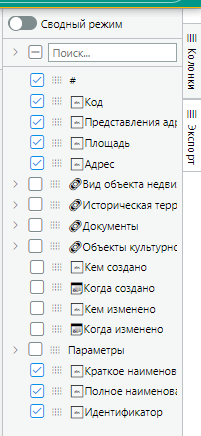
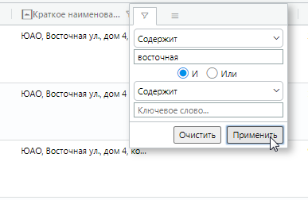
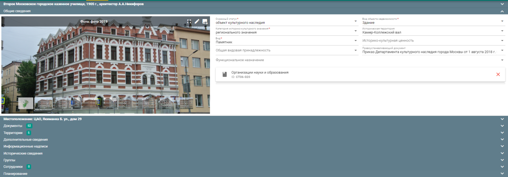

---
tags:
  - subsystem
---
Подсистема \"Реставрационные работы\"
=====================================

В подсистеме формируется перечень объектов, которые включены в
ремонтно-реставрационные программы, реализуемые как Мосгорнаследием, так
и другими органами исполнительной власти на федеральном и региональном
уровнях, для обеспечения возможности контроля за ходом работ. Подсистема
используется в ЛК руководителей ДКН, начальников и сотрудников УВР, УРД,
УТК, УСОАН.

> {width="5.566666666666666in"
> height="2.9069444444444446in"}
>
> **Рис. 258.** Реестр реставрационных работ

Подсистема позволяет добавлять в ручном режиме сведения об ОКН на
которых запланировано проведение реставрационных работ.

Для создания записи требуется нажать на кнопку
{width="0.36319444444444443in"
height="0.3194444444444444in"}. Откроется окно создания записи.

{width="4.267361111111111in"
height="3.18125in"}

**Рис. 259.** Создание записи о реставрационных работах

ОКН находится стандартным поиском по ключевой фразе и добавляется в
поле.

В разделе «Работы» поля заполняются путем выбора значений из
классификаторов, справочников и календаря, поля Вид работ/Планируемые
работы и Результат работ -- текстом.

В разделе «Процесс работ» указывается год и стоимость работ. Строки
можно добавлять кнопкой
{width="0.32222222222222224in"
height="0.3326388888888889in"} и удалять
{width="0.38472222222222224in"
height="0.38472222222222224in"}.

{width="6.497222222222222in"
height="1.8402777777777777in"}

**Рис. 260.** Процесс работ

Доступно написание текстового комментария.

{width="6.497222222222222in"
height="1.1104166666666666in"}

**Рис. 261.** Добавление комментария

После заполнения полей нужно нажать «Создать» и запись отобразится в
Реестре ремонтно-реставрационных работ (РРР).

В подсистеме \"Реставрационные работы\" реализованы стандартные поиск
данных и просмотр карточек ОКН и документов.

В Реестре РРР отображаются все ОКН, на которые выданы разрешения (из
реестра УВР) со сроками их исполнения и все остальные документы,
созданными или привязанными в АИС МГН по ходу выполнения работ.

В Реестре актов приемки осуществляется внесения сведений об актах
приемки выполненных работ, контроль работ -- в реестр
\"Предостережения\" на основании Реестра УВР.

После прикрепления отсканированного документа Акты приемки отображаются
в дереве документов в карточке ОКН в разделе «Приемка».
