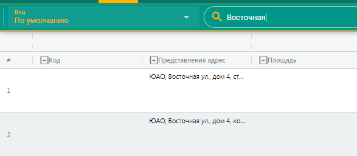

---
tags:
  - subsystem
---
Подсистема \"Рабочий стол руководителя\"
========================================

> Подсистема обеспечивает руководителю ДКН и его заместителям
> оперативный доступ к статистической информации из АИС МГН.

Подсистема «Рабочий стол руководителя» обеспечивает руководителю ДКН и
его заместителям оперативный доступ к статистической информации из АИС
МГН.

В ЛК РД и ПЗРД доступны перечни и реестры, формируемые в актуальном
режиме сотрудниками ДКН:

-   Реестр документов Инспекции

-   Реестр УРД

-   Согласование ПД

-   Реестр УСОАН

-   Реестр УВР

-   Статистика

{width="5.520833333333333in"
height="1.9375in"}

**Рис. 264.** Подсистема «Рабочий стол руководителя»

В разделе Планирование осуществляется планирование событий, связанных с
определенной датой и временем (мероприятия, встречи, праздники и др.),
планирование задач (заданий, дел) с возможностью контроля их
самостоятельного и (или) стороннего выполнения.

В разделе Новости формируется для просмотра подборка новостных сводок,
касающихся деятельности ДКН.

В разделе Статистика осуществляется отображение статистической
информации.

В разделе Контакты осуществляется управление контактами
(пользовательская адресно-телефонная книга).

Согласование, подпись и хранение документов доступно в разделах
«Документы, ожидающие решения», «Документы на контроле», «Рассмотренные
документы».
