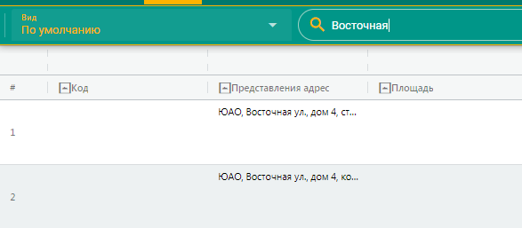

---
tags:
  - Мобильное приложение
---
Подсистема \"Мобильное приложение\"
===================================

> Подсистема Мобильное приложение обеспечивает отображение на планшетном
> мобильном устройстве информации, содержащейся в АИС МГН.

Состав отображаемых данных и доступные для использования функции зависят
от роли пользователя в Системе и соответствуют полной версии Личного
кабинета Пользователя.

**Рис. 262.** Интерфейс подсистемы Мобильное приложение

Для получения доступа к данным АИС МГН с мобильных устройств под
управлением ОС Android и iOS требуется настроить VPN соединение до
локальной сети ДКН.

После авторизации в системе пользователь заходит в Личный кабинет и в
соответствии со своей ролью в Системе получает возможности процессов
сбора, поиска и статистической обработки информации как в полной версии
сайта.

В ЛК Инспектора и Инспектора УТК доступна возможность делать
фотофиксацию изображения из карточки объекта в рамках дела о проверке
или мониторинга.

Для этого в карточке Дела о проверке в разделе Фото объектов нажать
{width="0.6284722222222222in"
height="0.22083333333333333in"}, откроется окно Прикрепления фото, в
котором можно выбрать из галереи устройства фотографии и сохранить их в
карточке Дела о проверке.

{width="3.4743055555555555in"
height="2.6083333333333334in"}

**Рис. 263.** Прикрепление фото

Пользователю с ролью Редактор УОГР в ЛК доступны операции:

1.  Уточнения наименования, датировки, авторства, предмета охраны
    объекта учета.

2.  Изменения или уточнения описания местонахождения объекта учета.

3.  Обновления фотографических изображений объекта учета.

4.  Изменения состояния объекта учета.

5.  Изменения или уточнения сведений о лице, в собственности или
    пользовании которого находится объект, соответствующий земельный
    участок, а также о правовом режиме использования данного земельного
    участка.

> Результаты выполнения операций сохраняются и отображаются в
> аналитических отчетах в разделе «Картина дня» в ЛК РД.

Все сформированные статистические отчеты по параметрам объектов учета с
возможностью выбора метода визуализации (таблица, диаграмма, гистограмма
и др.) и получения развернутого списка объектов по каждой статистической
единице отчета доступны из Подсистемы «Мобильное приложение».

Формирование отчетов и информационных справок по результатам ОГУ
сотрудниками ДКН, в части, касающейся выполнения их должностных
обязанностей, также доступны из Подсистемы «Мобильное приложение»
